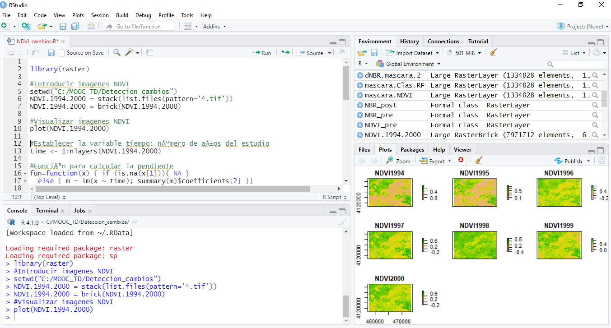
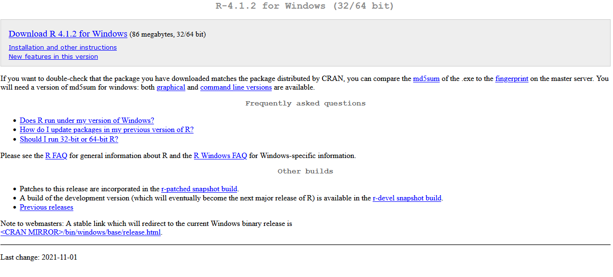

# Capitulo7-Sensores_Teledeteccion
## 1. DESCARGAR R Y RSTUDIO

RStudio Cloud es una versión en la nube del entorno de desarollo integrado para R y RStudio que no necesita instalación. RStudio Cloud se creó con el objetivo de facilitar a los profesionales y estudiantes la práctica, el intercambio y el aprendizaje de la ciencia de datos.  


RStudio Desktop es una aplicación de escritorio independiente de código abierto, que incluye una consola, un editor de sintaxis de lenguaje R, que admite ejecución directa de código, así como herramientas para gráficos y gestión del espacio del trabajo. Trabaja con la versión de R que tengas instalada en tu estación de trabajo local de Windows, Mac OS X o Linux.  

 

En los últimos tiempos, las nubes públicas han experimentado un rápido crecimiento a medida que las empresas se esfuerzan por virtualizar la mayor cantidad posible de sus operaciones, incluido el almacenamiento y análisis de datos. Lo más probable es que esta tendencia continue.

### 1.1. Instalar R y RStudio Desktop en local

#### 1.1.1. Instalar R

Para poder ejecutar códigos de R, primero es necesario instalar el software R que el sistema operativo de tu máquina necesite.

 

[Enlace de descarga](https://cran.r-project.org/bin/windows/base/)

Siempre es recomendable instalar la última versión disponible de R. Se pueden tener instaladas varias versiones de R en el mismo PC. Por tanto, no es necesario desinstalar una versión anterior antes de instalar una nueva.

#### 1.1.2. Instalar RStudio Desktop

RStudio Desktop es una aplicación como  puede serlo también Microsoft Word, excepto que en lugar de ayudar a escribir textos en español, RStudio ayuda a escribir en R. 

[Se puede descargar RStudio gratis](https://www.rstudio.com/products/rstudio/download/#download). Simplemente selecciona la descarga según tu sistema operativo y sigue las instrucciones de instalación. Una vez que se haya instalado RStudio, se puede abrir como cualquier otro programa en su PC, generalmente haciendo clic en un ícono en el escritorio. 

## 2. ACCESO Y DESCARGA DE IMÁGENES

En el presente ejercicio se va a aprender a gestionar la búsqueda y descarga de datos de imágenes satelitales empleando el lenguaje de R, lo que nos facilitará un posterior procesado de los datos, gracias a su potencia estadística y analítica.  
Por otro lado, existen numerosas fuentes de datos públicos que nos permiten obtener imágenes de satélites de forma gratuitas. Sin embargo, este ejercicio se va a centrar en el portal de datos Earth Explorer del USGS Servicio Geológico de Estados Unidos. 
Como base del ejercicio se estudiará el incendio acaecido entre los días 7 y 10 de agosto de 1993 en la provincia de Granada, afectando a unas 7.000 ha, de las cuales unas 250 ha estaban localizadas en el interior del Parque Natural de la Sierra de Huétor. En ella se quemaron repoblaciones de Pinus pinaster, Pinus halepensis, Pinus laricio y en menor medida con Pinus sylvestris y Populus realizadas en la década de los años 40 del siglo pasado. Tras el incendio, han sido escasas las labores de reforestación desarrolladas en la zona. La más significativa se ejecutó a finales de 1996 y consistió en una siembra aérea de 16 especies de pinos y matorral con muy bajos resultados.  

### 2.1. Registro en la plataforma Earth Explorer del USGS
Un requisito indispensable para la descarga de datos remotes en el registro en el portal de [Earth Explorer](https://earthexplorer.usgs.gov). Aunque en [este video](https://www.youtube.com/watch?v=eAmTxsg6ZYE) que os se ha colgado en la plataforma se explica cómo hacerlo, os dejamos unas indicaciones que esperamos os sirvan de ayuda. 

Al abrir el portal, la página tendrá un aspecto parecido a éste:  

  

Presionando en **login** en la esquina superir derecha, se accede a la pantalla del sistema de registro EROS, donde es necesario indicar que queremos crear una nueva cuenta (**Create New Account**).  

### 2.2. Búsqueda y selección de las imágenes
 
Se va a emplear la plataforma online de [RStudio Cloud](https://rstudio.cloud/), no es necesaria la descarga de ningún programa. Se trata de una solución ligera basada en la nube que permite a cualquier persona hacer, compartir, enseñar y aprender ciencia de datos en línea. No hay nada que configurar y no se requiere la instalación de ningún hardware. Lo único necesario es un navegador de internet. Para una introducción a la plataforma podeis ver [este video](https://www.youtube.com/watch?v=uK1Va_UWQFc).  

Para hacer un estudio completo del incendio mediante teledetección es recomendable disponer de una imagen de antes de que ocurriera el incendio y otra imagen posterior. De esta manera, comparando las diferencias entre ambas, es posible extraer el perímetro de la zona quemada, así como evaluar la severidad y otras características del mismo. Por ello, el proceso de búsqueda y selección de imágenes se va a repetir para 2 periodos distintos.   

#### 2.2.1 Antes del incendio

Primero, es preciso subir a la nube la capa con los límites de la zona de estudio que se han facilitado a través de la plataforma del curso con el nombre de Limites_AOI. Aunque el archivo está comprimido en formato zip, se deben subir los 4 archivos individuales que describen la capa, los archivos tienen las siguientes extensiones .dbf, .prj, .shp, .shx. Ésto se realiza a través del botón **upload** de la pestaña **Files** en el cuadro inferior derecho. Una vez realizado, se verá así:  
 

Seguidamente, se configura la plataforma para las funciones que se van a emplear.  

```{r eval=FALSE }
# Instalación del paquete sf (simple features) que permite el acceso a datos geograficos
#install.packages("sf")
# Activación del paquete una vez descargado
library(sf)

# Instalación del paquete devtools que permite la descarga del paquete en desarrollo siguiente
#install.packages("devtools")
# Activación del paquete anterior
library(devtools)

# Instalación del paquete getSpatialData que permite la descarga de imágenes espaciales
#devtools::install_github("16EAGLE/getSpatialData")
# Activación del paquete anterior
library(getSpatialData)
```

getSpatialData se encuentra en una etapa inicial de desarrollo. Tiene como objetivo permitir flujos de trabajo homogéneos y reproducibles para consultar, obtener una vista previa, analizar, seleccionar, ordenar y descargar varios tipos de conjuntos de datos espaciales de fuentes abiertas. Permite el acceso genérico a múltiples distribuidores de datos con una sintasis común para 159 productos. Entre otros, getSpatialData admite estos productos: Sentinel-1, Sentinel-2, Sentinel-3, Sentinel-5P, Landsat 8 OLI, Landsat ETM, Landsat TM, Landsat MSS, MODIS (Terra & Aqua) y SRTM DEM. Para ello, getSpatialData facilita el acceso a múltiples servicios implementando clientes a API públicas de ESA Copernicus Open Access Hub, USGS EarthExplorer, USGS EROS ESPA, Amazon Web Services (AWS), NASA DAAC LAADS y NASA CMR search. 
A continuación, se introduce la zona de estudio, se define como los límites de la zona de interés para la búsqueda de imágenes y, finalmente, se visualiza sobre un mapa interactivo:  


```{r}
#Leer los límites de la zona de estudio donde se produjo el incendio
library(sf)
Limites.AOI<-st_read("E:/MOOC_TD/Limites_AOI.shp")

# Definir los límites como nuestra zona de interés o area of interest (AOI):
library(getSpatialData)
set_aoi(Limites.AOI$geometry)

# Visualizar la zona
view_aoi()
```

[](AOI.html)

A partir de este punto, es necesario logarse dentro de la plataforma EarthExplorer con las credenciales obtenidas en el paso anterior para poder realizar la búsqueda de imágenes. El valor **"xxxxxx"** es necesario sustituirlo por nuestro usuario.

```{r  }
# Login en la plataforma USGS
login_USGS(username = "xxxxxx")
```

Posteriormente, se introducirá la contraseña asociada en la ventana emergente. 

 

```{r}
# Productos de imágenes satelitales disponibles a través de getSpatialData
get_products()

# Centrándonos en los productos de Landsat
getLandsat_products()
```

Se puede comprobar que a través de este sistema se puede acceder a diversos productos de satélites como Sentinel-1, Sentinel-2, Sentinel-3, Sentinel-5P, Landsat 8 OLI, Landsat ETM, Landsat TM, Landsat MSS, MODIS (Terra & Aqua) y SRTM DEM.  

Para entender a qué conjunto de datos se refiere cada producto:  

[Fuente](https://grass.osgeo.org/grass78/manuals/addons/i.landsat.download.html) 

Ahora se procede a la búsqueda concreta de las imágenes. Se va a emplear el producto **landsat_tm_c2_l2** que se refiere a los datos procedentes de Landsat 5 TM, satélite operativo en el periodo en el que ocurrió el incendio, con nivel de procesamiento 2. Puesto que el siniestro ocurrió en el mes de agosto, es razonable pensar que una imagen de primavera del mismo año podría generar el contraste necesario para el análisis del suceso.  Es por ello que se va a emplear el mes de marzo como rango de búsqueda temporal.

```{r}
# Búsqueda de las imágenes
imagenes <- getLandsat_records(time_range = c("1993-03-01", "1993-04-01"), 
                               products = "landsat_tm_c2_l2")
```

En la esquina superior derecha del proyecto de RStudio, en la pestaña **Environment** se habrá generado una veriable de datos llamada **busqueda** con 18 observaciones y 20 variables. Se puede visualizar con el siguiente comando:  

```{r}
# Visualizar resultados de la búsqueda
View(imagenes)
```

La tabla con los resultados de la búsqueda continene en nombre de las imágenes (**record_id**), el identificador de esa imagen dentro del repositorio (**entity_id**), la hora de comienzo y fin del escaneado del sensor (**start_time** y **stop_time**), si se trata de un imagen diurna o nocturna (**day_or_night**), fecha de la publicación de los datos (**data_publish**), la huella que cubre la imagen (**footprint**), el path y row del paso del satélite al que corresponde la imagen (**tile_number_horizontal**,  **tile_number_certical** y **tile_id**), dirección web en la que se encuentra alojada la previsualización de la imagen (**preview_url**), tipo de sensor (**sensor_id**), porcentaje de cobertura de nubes de la imagen (**cloudcov_land** y **cloudcov**), nivel de procesado (**level**), colección y categoría(**collection** y **Collection_category**), tipo de productos (**product** y **Product_group**) y fecha de adquisición de los datos (**data_acquisition**).  

Seguidamente, se van a filtrar los resultados por los que se refieren a nivel **l1**.

```{r}
# Filtrado de resultados por los correspondientes al nivel "l1"
imagenes <- imagenes[imagenes$level == "l1",]

# Visualizar resultados del filtrado
View(imagenes)
```

Tan sólo encontramos 2 imágenes con dichas características con fecha de adquisición del 13 de marzo y de 29 de marzo de 1993.  

Para decidir cuál representa mejor el momento anterior al incendio, es aconsejable  visualizar las vistas previas:  

```{r}
# Establacer el direcorio de descarga
set_archive("C:/DESCARGA")

# Descarga de las vistas previas georreferenciadas de las imágenes
imagenes <- get_previews(imagenes) 

# Visualizar la vista previa de la primera imagen
plot_previews(imagenes[1,])

# Visualizar la vista previa de la segunda imagen
plot_previews(imagenes[2,])
```

Al comparar ambas previsualizaciones, queda claro que la segunda imagen es la que contiene los datos más claros de la zona de estudio.  

Finalmente, se pasa a obtener el enlace de descarga de la imagen seleccionada y se adquiere la imagen.

```{r eval=FALSE}
# Enlace de descarga
url_<-paste0("https://landsatlook.usgs.gov/bundle/",
             (imagenes$record_id[2]),".tar")

# ADVERTENCIA: ANTES DE EJECUTAR EL SIGUIENTE PASO SE DEBE HABER INICIADO SESIÓN EN LA PLATAFORMA EARTHEXPLORER DENTRO DEL NAVEGADOR DE INTERNET. 
# Descarga
browseURL(url_)  
```

#### 2.2.2 Después del incendio

Se repite el proceso buscando ahora la descarga de la imagen Landsat posterior al incendio más adecuada para el análisis de los datos. Se va a utilizar una extensión temporal mayor en la búsqueda puesto que la estación otoñal podría causar un aumento en la nubosidad de la zona de estudio.

```{r}
# Búsqueda de las imágenes
imagenes <- getLandsat_records(time_range = c("1993-09-01", "1993-10-30"), 
                               products = "landsat_tm_c2_l2")
```


```{r}
# Filtrado de resultados por los correspondientes al nivel "l1"
imagenes <- imagenes[imagenes$level == "l1",]

# Visualizar resultados del filtrado
View(imagenes)
```

```{r}
# Establacer el direcorio de descarga
set_archive("C:/DESCARGA")

# Descarga de las vistas previas georreferenciadas de las imágenes
imagenes <- get_previews(imagenes) 

# Visualizar la vista previa de la primera imagen
plot_previews(imagenes[1,])

# Visualizar la vista previa de la segunda imagen
plot_previews(imagenes[2,])

# Visualizar la vista previa de la tercera imagen
plot_previews(imagenes[3,])

# Visualizar la vista previa de la cuarta imagen
plot_previews(imagenes[4,])
```

```{r eval=FALSE}
# Enlace de descarga
url_<-paste0("https://landsatlook.usgs.gov/bundle/",
             (imagenes$record_id[4]),".tar")

# Descarga
browseURL(url_)  
```


## 3. ÍNDICES DE VEGETACIÓN

