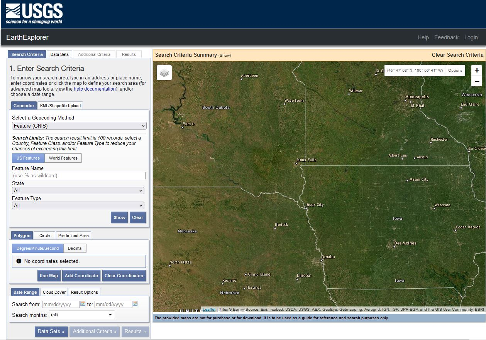
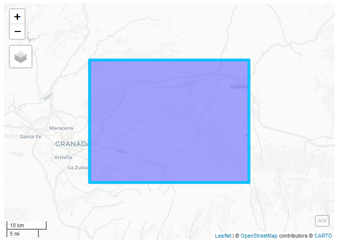
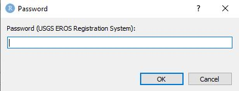
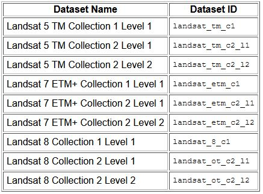
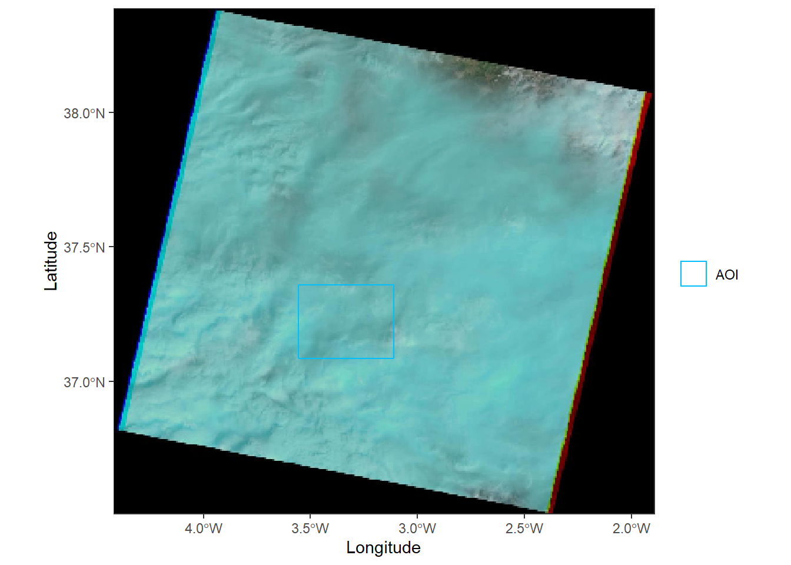
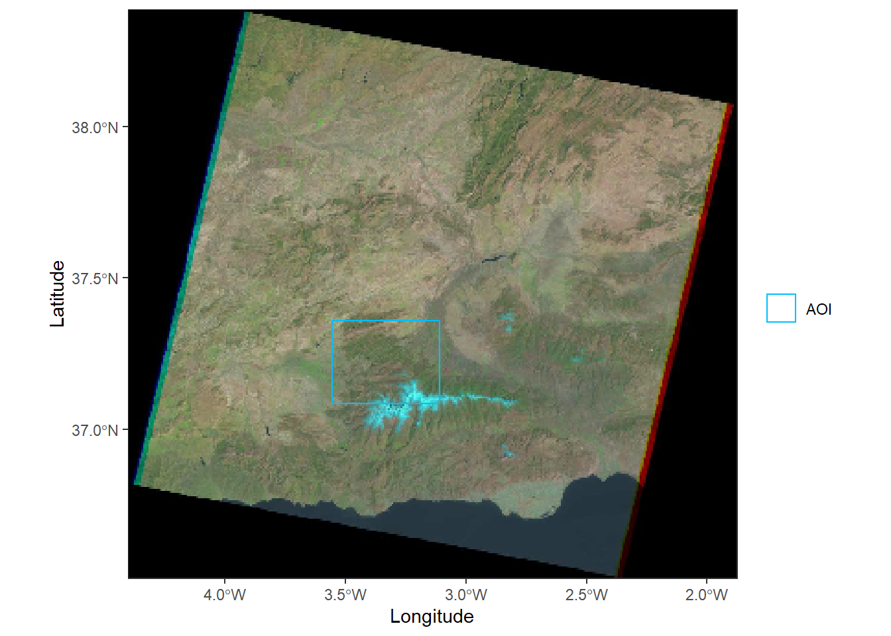
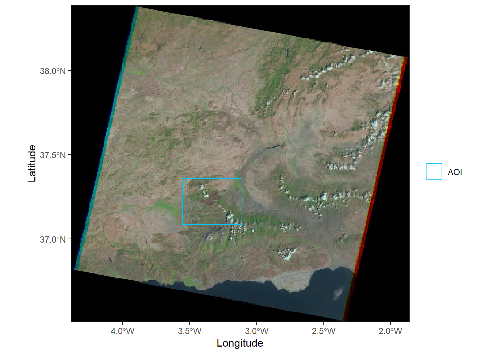
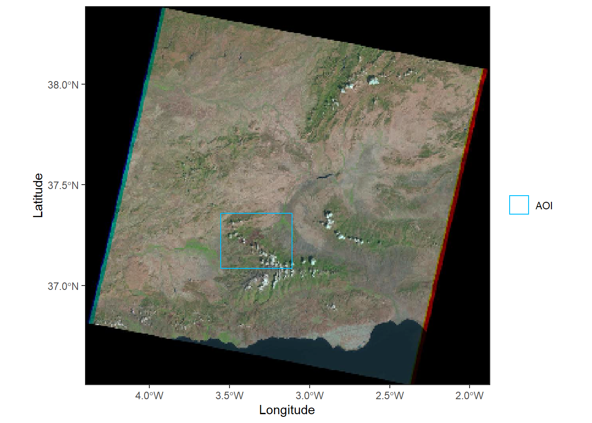
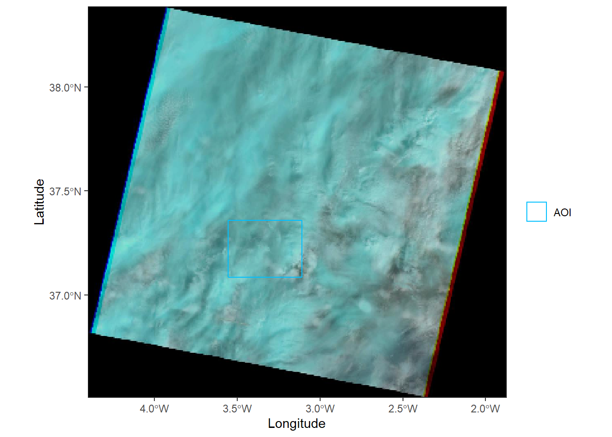
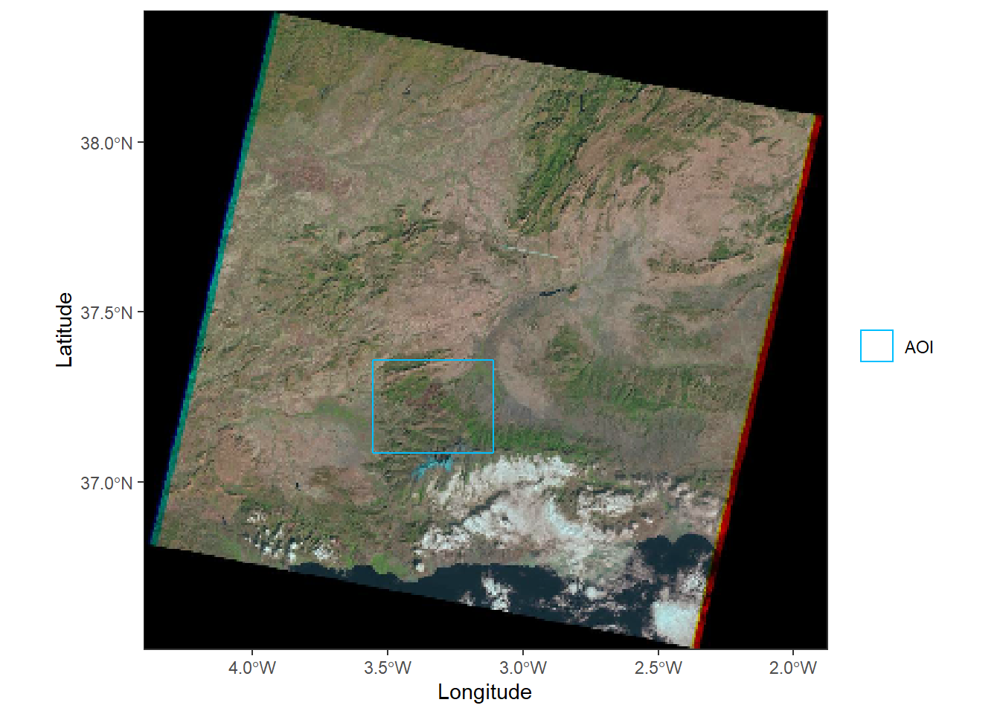

# summer_school_TD

[](https://zenodo.org/badge/latestdoi/694532533)

# Descarga de datos y Teledetección con R

En el presente ejercicio se va a aprender a gestionar la búsqueda y descarga de datos de imágenes satelitales empleando el lenguaje de R, lo que nos facilitará un posterior procesado de los datos, gracias a su potencia estadística y analítica.  

## 1. Acceso y descarga de imágenes satelitales

Existen numerosas fuentes de datos públicos que nos permiten obtener imágenes de satélites de forma gratuitas. Sin embargo, este ejercicio se va a centrar en el portal de datos Earth Explorer del USGS Servicio Geológico de Estados Unidos. 

Como base del ejercicio se estudiará el incendio acaecido entre los días 7 y 10 de agosto de 1993 en la provincia de Granada, afectando a unas 7.000 ha, de las cuales unas 250 ha estaban localizadas en el interior del Parque Natural de la Sierra de Huétor. En ella se quemaron repoblaciones de *Pinus pinaster*, *Pinus halepensis*, Pinus laricio y en menor medida con *Pinus sylvestris* y Populus realizadas en la década de los años 40 del siglo pasado. Tras el incendio, han sido escasas las labores de reforestación desarrolladas en la zona. La más significativa se ejecutó a finales de 1996 y consistió en una siembra aérea de 16 especies de pinos y matorral con muy bajos resultados.  

### 1.1. Registro en la plataforma Earth Explorer del USGS

Un requisito indispensable para la descarga de datos remotes en el registro en el portal de [Earth Explorer](https://earthexplorer.usgs.gov). Aunque en [este video](https://www.youtube.com/watch?v=eAmTxsg6ZYE) se explica cómo hacerlo, os dejamos unas indicaciones que esperamos os sirvan de ayuda. 

Al abrir el portal, la página tendrá un aspecto parecido a éste:  

  

Presionando en **login** en la esquina superir derecha, se accede a la pantalla del sistema de registro EROS, donde es necesario indicar que queremos crear una nueva cuenta (**Create New Account**).  

### 1.2. Búsqueda y selección de las imágenes

Para hacer un estudio completo del incendio mediante teledetección es recomendable disponer de una imagen de antes de que ocurriera el incendio y otra imagen posterior. De esta manera, comparando las diferencias entre ambas, es posible extraer el perímetro de la zona quemada, así como evaluar la severidad y otras características del mismo. Por ello, el proceso de búsqueda y selección de imágenes se va a repetir para 2 periodos distintos.   

#### 1.2.1 Antes del incendio

Primero, es preciso subir a la nube la capa con los límites de la zona de estudio que se han facilitado a través de la plataforma con el nombre de Limites_AOI. Aunque el archivo está comprimido en formato zip, se deben subir los 4 archivos individuales que describen la capa, los archivos tienen las siguientes extensiones .dbf, .prj, .shp, .shx. Ésto se realiza a través del botón **upload** de la pestaña **Files** en el cuadro inferior derecho. Una vez realizado, se verá así:  
 

Seguidamente, se configura la plataforma para las funciones que se van a emplear.  

```r 
# Instalación del paquete sf (simple features) que permite el acceso a datos geograficos
#install.packages("sf")
# Activación del paquete una vez descargado
library(sf)

# Instalación del paquete devtools que permite la descarga del paquete en desarrollo siguiente
#install.packages("devtools")
# Activación del paquete anterior
library(devtools)

# Instalación del paquete getSpatialData que permite la descarga de imágenes espaciales
#devtools::install_github("16EAGLE/getSpatialData")
# Activación del paquete anterior
library(getSpatialData)
```

getSpatialData se encuentra en una etapa inicial de desarrollo. Tiene como objetivo permitir flujos de trabajo homogéneos y reproducibles para consultar, obtener una vista previa, analizar, seleccionar, ordenar y descargar varios tipos de conjuntos de datos espaciales de fuentes abiertas. Permite el acceso genérico a múltiples distribuidores de datos con una sintasis común para 159 productos. Entre otros, getSpatialData admite estos productos: Sentinel-1, Sentinel-2, Sentinel-3, Sentinel-5P, Landsat 8 OLI, Landsat ETM, Landsat TM, Landsat MSS, MODIS (Terra & Aqua) y SRTM DEM. Para ello, getSpatialData facilita el acceso a múltiples servicios implementando clientes a API públicas de ESA Copernicus Open Access Hub, USGS EarthExplorer, USGS EROS ESPA, Amazon Web Services (AWS), NASA DAAC LAADS y NASA CMR search. 

A continuación, se introduce la zona de estudio, se define como los límites de la zona de interés para la búsqueda de imágenes y, finalmente, se visualiza sobre un mapa interactivo:  


```r
#Leer los límites de la zona de estudio donde se produjo el incendio
library(sf)
Limites.AOI<-st_read("C:/DESCARGA/Limites_AOI.shp") #Adaptar a la ruta donde se han descargado los archivos shapefile Limites_AOI

# Definir los límites como nuestra zona de interés o area of interest (AOI):
library(getSpatialData)
set_aoi(Limites.AOI$geometry)

# Visualizar la zona
view_aoi()
```



A partir de este punto, es necesario logarse dentro de la plataforma EarthExplorer con las credenciales obtenidas en el paso anterior para poder realizar la búsqueda de imágenes. El valor **"xxxxxx"** es necesario sustituirlo por nuestro usuario.

```r
# Login en la plataforma USGS
login_USGS(username = "xxxxxx")
```

Posteriormente, se introducirá la contraseña asociada en la ventana emergente. 

 

```r
# Productos de imágenes satelitales disponibles a través de getSpatialData
get_products()
```

```r annotate
##   [1] "sentinel-1"            "sentinel-2"            "sentinel-3"           
##   [4] "sentinel-5p"           "sentinel-1_gnss"       "sentinel-2_gnss"      
##   [7] "sentinel-3_gnss"       "landsat_8_c1"          "lsr_landsat_8_c1"     
##  [10] "landsat_ot_c2_l1"      "landsat_ot_c2_l2"      "landsat_etm_c1"       
##  [13] "lsr_landsat_etm_c1"    "landsat_etm_c2_l1"     "landsat_etm_c2_l2"    
##  [16] "landsat_tm_c1"         "lsr_landsat_tm_c1"     "landsat_tm_c2_l1"     
##  [19] "landsat_tm_c2_l2"      "landsat_mss_c1"        "landsat_mss_c2_l1"    
##  [22] "modis_mcd64a1_v6"      "modis_mod09a1_v6"      "modis_mod09cmg_v6"    
##  [25] "modis_mod14_v6"        "modis_mod09ga_v6"      "modis_mod14a1_v6"     
##  [28] "modis_mod09gq_v6"      "modis_mod14a2_v6"      "emodis_global_lst_v6" 
##  [31] "modis_mod09q1_v6"      "modis_modocga_v6"      "modis_myd14_v6"       
##  [34] "emodis"                "modis_modtbga_v6"      "modis_myd14a1_v6"     
##  [37] "emodis_ndvi_v6"        "modis_myd09a1_v6"      "modis_myd14a2_v6"     
##  [40] "emodis_phen_metrics"   "modis_myd09cmg_v6"     "modis_myd09ga_v6"     
##  [43] "modis_myd09gq_v6"      "modis_myd09q1_v6"      "modis_mydocga_v6"     
##  [46] "modis_mydtbga_v6"      "lpcs_modis_mcd12q1"    "lpcs_modis_mcd43a3"   
##  [49] "lpcs_modis_mod09a1"    "lpcs_modis_mod09ga"    "lpcs_modis_mod09gq"   
##  [52] "lpcs_modis_mod09q1"    "lpcs_modis_mod11a1"    "lpcs_modis_mod13a1"   
##  [55] "lpcs_modis_mod13a2"    "lpcs_modis_mod13a3"    "lpcs_modis_mod13q1"   
##  [58] "lpcs_modis_myd09a1"    "lpcs_modis_myd09ga"    "lpcs_modis_myd09gq"   
##  [61] "lpcs_modis_myd09q1"    "lpcs_modis_myd11a1"    "lpcs_modis_myd13a1"   
##  [64] "lpcs_modis_myd13a2"    "lpcs_modis_myd13a3"    "lpcs_modis_myd13q1"   
##  [67] "modis_mcd12c1_v6"      "modis_mcd12q1_v6"      "modis_mcd12q2_v6"     
##  [70] "modis_mcd15a2h_v6"     "modis_mcd15a3h_v6"     "modis_mcd19a1_v6"     
##  [73] "modis_mcd19a2_v6"      "modis_mcd19a3_v6"      "modis_mcd43a1_v6"     
##  [76] "modis_mcd43a2_v6"      "modis_mcd43a3_v6"      "modis_mcd43a4_v6"     
##  [79] "modis_mcd43c1_v6"      "modis_mcd43c2_v6"      "modis_mcd43c3_v6"     
##  [82] "modis_mcd43c4_v6"      "modis_mcd43d01_v6"     "modis_mcd43d02_v6"    
##  [85] "modis_mcd43d03_v6"     "modis_mcd43d04_v6"     "modis_mcd43d05_v6"    
##  [88] "modis_mcd43d06_v6"     "modis_mcd43d07_v6"     "modis_mcd43d08_v6"    
##  [91] "modis_mcd43d09_v6"     "modis_mcd43d10_v6"     "modis_mcd43d11_v6"    
##  [94] "modis_mcd43d12_v6"     "modis_mcd43d13_v6"     "modis_mcd43d14_v6"    
##  [97] "modis_mcd43d15_v6"     "modis_mcd43d16_v6"     "modis_mcd43d17_v6"    
## [100] "modis_mcd43d18_v6"     "modis_mcd43d19_v6"     "modis_mcd43d20_v6"    
## [103] "modis_mcd43d21_v6"     "modis_mcd43d22_v6"     "modis_mcd43d23_v6"    
## [106] "modis_mcd43d24_v6"     "modis_mcd43d25_v6"     "modis_mcd43d26_v6"    
## [109] "modis_mcd43d27_v6"     "modis_mcd43d28_v6"     "modis_mcd43d29_v6"    
## [112] "modis_mcd43d30_v6"     "modis_mcd43d31_v6"     "modis_mcd43d32_v6"    
## [115] "modis_mcd43d33_v6"     "modis_mcd43d34_v6"     "modis_mcd43d35_v6"    
## [118] "modis_mcd43d36_v6"     "modis_mcd43d37_v6"     "modis_mcd43d38_v6"    
## [121] "modis_mcd43d39_v6"     "modis_mcd43d40_v6"     "modis_mcd43d41_v6"    
## [124] "modis_mcd43d42_v6"     "modis_mcd43d43_v6"     "modis_mcd43d44_v6"    
## [127] "modis_mcd43d45_v6"     "modis_mcd43d46_v6"     "modis_mcd43d47_v6"    
## [130] "modis_mcd43d48_v6"     "modis_mcd43d49_v6"     "modis_mcd43d50_v6"    
## [133] "modis_mcd43d51_v6"     "modis_mcd43d52_v6"     "modis_mcd43d53_v6"    
## [136] "modis_mcd43d54_v6"     "modis_mcd43d55_v6"     "modis_mcd43d56_v6"    
## [139] "modis_mcd43d57_v6"     "modis_mcd43d58_v6"     "modis_mcd43d59_v6"    
## [142] "modis_mcd43d60_v6"     "modis_mcd43d61_v6"     "modis_mcd43d62_v6"    
## [145] "modis_mcd43d63_v6"     "modis_mcd43d64_v6"     "modis_mcd43d65_v6"    
## [148] "modis_mcd43d66_v6"     "modis_mcd43d67_v6"     "modis_mcd43d68_v6"    
## [151] "modis_mod11a1_v6"      "modis_mod11a2_v6"      "modis_mod11b1_v6"     
## [154] "modis_mod11b2_v6"      "modis_mod11b3_v6"      "modis_mod11c1_v6"     
## [157] "modis_mod11c2_v6"      "modis_mod11c3_v6"      "modis_mod11_l2_v6"    
## [160] "modis_mod13a1_v6"      "modis_mod13a2_v6"      "modis_mod13a3_v6"     
## [163] "modis_mod13c1_v6"      "modis_mod13c2_v6"      "modis_mod13q1_v6"     
## [166] "modis_mod15a2h_v6"     "modis_mod16a2_v6"      "modis_mod17a2h_v6"    
## [169] "modis_mod44b_v6"       "modis_mod44w_v6"       "modis_myd11a1_v6"     
## [172] "modis_myd11a2_v6"      "modis_myd11b1_v6"      "modis_myd11b2_v6"     
## [175] "modis_myd11b3_v6"      "modis_myd11c1_v6"      "modis_myd11c2_v6"     
## [178] "modis_myd11c3_v6"      "modis_myd11_l2_v6"     "modis_myd13a1_v6"     
## [181] "modis_myd13a2_v6"      "modis_myd13a3_v6"      "modis_myd13c1_v6"     
## [184] "modis_myd13c2_v6"      "modis_myd13q1_v6"      "modis_myd15a2h_v6"    
## [187] "modis_myd16a2_v6"      "modis_myd17a2h_v6"     "modis_myd21a1d_v6"    
## [190] "modis_myd21a1n_v6"     "modis_myd21a2_v6"      "modis_myd21_v6"       
## [193] "srtm_global_3arc_v003" "srtm_global_1arc_v001"
```

```r
# Centrándonos en los productos de Landsat
getLandsat_products()
```

```r annotate
##  [1] "landsat_8_c1"              "lsr_landsat_8_c1"         
##  [3] "landsat_ot_c2_l1"          "landsat_ot_c2_l2"         
##  [5] "landsat_etm_c1"            "lsr_landsat_etm_c1"       
##  [7] "landsat_etm_c2_l1"         "landsat_etm_c2_l2"        
##  [9] "landsat_tm_c1"             "lsr_landsat_tm_c1"        
## [11] "landsat_tm_c2_l1"          "landsat_tm_c2_l2"         
## [13] "landsat_mss_c1"            "landsat_mss_c2_l1"        
## [15] "landsat_ard_tile_c2"       "landsat_ard_tile_files_c2"
```

Se puede comprobar que a través de este sistema se puede acceder a diversos productos de satélites como Sentinel-1, Sentinel-2, Sentinel-3, Sentinel-5P, Landsat 8 OLI, Landsat ETM, Landsat TM, Landsat MSS, MODIS (Terra & Aqua) y SRTM DEM.  

Para entender a qué conjunto de datos se refiere cada producto:  

 

[Fuente](https://grass.osgeo.org/grass78/manuals/addons/i.landsat.download.html) 

Ahora se procede a la búsqueda concreta de las imágenes. Se va a emplear el producto **landsat_tm_c2_l2** que se refiere a los datos procedentes de Landsat 5 TM, satélite operativo en el periodo en el que ocurrió el incendio, con nivel de procesamiento 2. Puesto que el siniestro ocurrió en el mes de agosto, es razonable pensar que una imagen de primavera del mismo año podría generar el contraste necesario para el análisis del suceso.  Es por ello que se va a emplear el mes de marzo como rango de búsqueda temporal.

```r
# Búsqueda de las imágenes
imagenes <- getLandsat_records(time_range = c("1993-03-01", "1993-04-01"), 
                               products = "landsat_tm_c2_l2")
```

```r annotate
## Searching records for product name 'landsat_tm_c2_l2'...
## Found a total of 20 records.
```

En la esquina superior derecha del proyecto de RStudio, en la pestaña **Environment** se habrá generado una veriable de datos llamada **busqueda** con 18 observaciones y 20 variables. Se puede visualizar con el siguiente comando:  

```r
# Visualizar resultados de la búsqueda
View(imagenes)
```

La tabla con los resultados de la búsqueda continene en nombre de las imágenes (**record_id**), el identificador de esa imagen dentro del repositorio (**entity_id**), la hora de comienzo y fin del escaneado del sensor (**start_time** y **stop_time**), si se trata de un imagen diurna o nocturna (**day_or_night**), fecha de la publicación de los datos (**data_publish**), la huella que cubre la imagen (**footprint**), el path y row del paso del satélite al que corresponde la imagen (**tile_number_horizontal**,  **tile_number_certical** y **tile_id**), dirección web en la que se encuentra alojada la previsualización de la imagen (**preview_url**), tipo de sensor (**sensor_id**), porcentaje de cobertura de nubes de la imagen (**cloudcov_land** y **cloudcov**), nivel de procesado (**level**), colección y categoría(**collection** y **Collection_category**), tipo de productos (**product** y **Product_group**) y fecha de adquisición de los datos (**data_acquisition**).  

Seguidamente, se van a filtrar los resultados por los que se refieren a nivel **l1**.

```r
# Filtrado de resultados por los correspondientes al nivel "l1"
imagenes <- imagenes[imagenes$level == "l1",]

# Visualizar resultados del filtrado
View(imagenes)
```

Tan sólo encontramos 2 imágenes con dichas características con fecha de adquisición del 13 de marzo y de 29 de marzo de 1993.  

Para decidir cuál representa mejor el momento anterior al incendio, es aconsejable  visualizar las vistas previas:  

```r
# Establacer el direcorio de descarga
set_archive("C:/DESCARGA")  #Adaptar

# Descarga de las vistas previas georreferenciadas de las imágenes
imagenes <- get_previews(imagenes) 

# Visualizar la vista previa de la primera imagen
plot_previews(imagenes[1,])
```
 

```r
# Visualizar la vista previa de la segunda imagen
plot_previews(imagenes[2,])
```

 

Al comparar ambas previsualizaciones, queda claro que la segunda imagen es la que contiene los datos más claros de la zona de estudio.  

Finalmente, se pasa a obtener el enlace de descarga de la imagen seleccionada y se adquiere la imagen.

```r
# Enlace de descarga
url_<-paste0("https://landsatlook.usgs.gov/bundle/",
             (imagenes$record_id[2]),".tar")

# ADVERTENCIA: ANTES DE EJECUTAR EL SIGUIENTE PASO SE DEBE HABER INICIADO SESIÓN EN LA PLATAFORMA EARTHEXPLORER DENTRO DEL NAVEGADOR DE INTERNET. 
# Descarga
browseURL(url_)  
```

#### 1.2.2 Después del incendio

Se repite el proceso buscando ahora la descarga de la imagen Landsat posterior al incendio más adecuada para el análisis de los datos. Se va a utilizar una extensión temporal mayor en la búsqueda puesto que la estación otoñal podría causar un aumento en la nubosidad de la zona de estudio.

```r
# Búsqueda de las imágenes
imagenes <- getLandsat_records(time_range = c("1993-09-01", "1993-10-30"), 
                               products = "landsat_tm_c2_l2")
```

```r
# Filtrado de resultados por los correspondientes al nivel "l1"
imagenes <- imagenes[imagenes$level == "l1",]

# Visualizar resultados del filtrado
View(imagenes)
```

```r
# Establacer el direcorio de descarga
set_archive("C:/DESCARGA") #Adaptar

# Descarga de las vistas previas georreferenciadas de las imágenes
imagenes <- get_previews(imagenes) 

# Visualizar la vista previa de la primera imagen
plot_previews(imagenes[1,])
```
 

```r
# Visualizar la vista previa de la segunda imagen
plot_previews(imagenes[2,])
```
 

```r
# Visualizar la vista previa de la tercera imagen
plot_previews(imagenes[3,])
```
 

```r
# Visualizar la vista previa de la cuarta imagen
plot_previews(imagenes[4,])
```
 

```r
# Enlace de descarga
url_<-paste0("https://landsatlook.usgs.gov/bundle/",
             (imagenes$record_id[4]),".tar")

# Descarga
browseURL(url_)  
```

## 2. Visualización de imágenes

Primero se va a aprender a visualizar y manejar las imágenes de satélite, intentando comprender la organización interna de las mismas, cómo se configura la estructura de sus datos y la información que aportan del terreno.

#### 2.1. Preparación de los datos en el entorno RStudio Cloud
 
Como se ha explicado, el satélite Landsat 5 TM, opera en las siguientes bandas:  

|Nº de Banda  |Nombre de Banda    |Longitud de onda    |Resolución |
|-------------|-------------------|--------------------|-----------|
|Band 1       |Azul               |(0.45 - 0.52 µm)    | 30 m      |
|Band 2       |Verde              |(0.52 - 0.60 µm)    | 30 m      |
|Band 3       |Rojo               |(0.63 - 0.69 µm)    | 30 m      |
|Band 4       |Infrarrojo cercano |(0.76 - 0.90 µm)    | 30 m      |
|Band 5       |Infrarrojo cercano |(1.55 - 1.75 µm)    | 30 m      |
|Band 6       |Infrarrojo térmico |(10.40 - 12.50 µm)  |120 m      |
|Band 7       |Infrarrojo medio   |(2.08 - 2.35 µm)    | 30 m      |

##### Archivos de las bandas

Las bandas Landsat individuales para una escena se colocan en archivos GeoTIFF separados que se distinguen por el final de sus nombres. Por ejemplo, para los datos de Landsat 5 nivel 2 (LT05_L2SP), ruta 200 y fila 34 (200034), del 29 de marzo de 1993 (19930329), los siguientes archivos son archivos de datos para las diferentes bandas:

- LT05_L2SP_200034_19930329_20200914_02_T1_SR_B1.TIF (azul)  
- LT05_L2SP_200034_19930329_20200914_02_T1_SR_B2.TIF (verde)  
- LT05_L2SP_200034_19930329_20200914_02_T1_SR_B3.TIF (rojo)  
- LT05_L2SP_200034_19930329_20200914_02_T1_SR_B4.TIF (infrarrojo cercano 1)  
- LT05_L2SP_200034_19930329_20200914_02_T1_SR_B5.TIF (infrarrojo cercano 2)  
- LT05_L2SP_200034_19930329_20200914_02_T1_SR_B6.TIF (infrarrojos térmicos)
- LT05_L2SP_200034_19930329_20200914_02_T1_SR_B7.TIF (infrarrojos medio)  

Por otro lado, se proporcionan archivos GeoTIFF adicionales conn información más detallada sobre los datos y el procesamiento de datos.  
    
- LT05_L2SP_200034_19930329_20200914_02_T1_ANG.txt: Archivo con los coeficientes angulares de la imagen  
- LT05_L2SP_200034_19930329_20200914_02_T1_MTL.json: Archivo de metadatos de la imagen en formato JavaScript  
- LT05_L2SP_200034_19930329_20200914_02_T1_MTL.txt: Archivo de metadatos de la imagen en formato txt  
- LT05_L2SP_200034_19930329_20200914_02_T1_MTL.xml: Archivo de metadatos de la imagen en formato xml  
- LT05_L2SP_200034_19930329_20200914_02_T1_QA_PIXEL.TIF: Banda de ajuste de calidad de píxeles  
- LT05_L2SP_200034_19930329_20200914_02_T1_QA_RADSAT.TIF: Saturación radiométrica y banda QA de oclusión del terreno  
- LT05_L2SP_200034_19930329_20200914_02_T1_SR_ATMOS_OPACITY.TIF: Banda de opacidad atmosférica
- LT05_L2SP_200034_19930329_20200914_02_T1_SR_CLOUD_QA.TIF: Calidad de la reflectancia superficial creada durante el procesado
- LT05_L2SP_200034_19930329_20200914_02_T1_ST_ATRAN.TIF: Banda de transmitancia atmosférica
- LT05_L2SP_200034_19930329_20200914_02_T1_ST_CDIST.TIF: Distancia en kilómetros de cada píxel a la nube más cercana de la banda QA_PIXEL  
- LT05_L2SP_200034_19930329_20200914_02_T1_ST_DRAD.TIF: Banda térmica de radiancia ascendente  
- LT05_L2SP_200034_19930329_20200914_02_T1_ST_EMIS.TIF: Emisividad de superficie estimada de los archivos ASTER GED  
- LT05_L2SP_200034_19930329_20200914_02_T1_ST_EMSD.TIF: Desviación estándar esperada de la emisividad de superficie estimada  
- LT05_L2SP_200034_19930329_20200914_02_T1_ST_QA.TIF: Incertidumbre en la temperatura de superficie
- LT05_L2SP_200034_19930329_20200914_02_T1_ST_TRAD.TIF: Banda térmica de nivel 1 convertida en radiancia de superficie térmica  
- LT05_L2SP_200034_19930329_20200914_02_T1_ST_URAD.TIF: Banda térmica de radiancia ascendente  
- LT05_L2SP_200034_19930329_20200914_02_T1_thumb_large.jpeg: Visualización rápida de la imagen en tamaño grande  
- LT05_L2SP_200034_19930329_20200914_02_T1_thumb_small.jpeg: Visualización rápida de la imagen en tamaño pequeño  

Se puede profundizar aún más con [la guía de los porductos Landsat 4-7 de la colección 2, nivel 2](https://d9-wret.s3.us-west-2.amazonaws.com/assets/palladium/production/s3fs-public/media/files/LSDS-1618_Landsat-4-7_C2-L2-ScienceProductGuide-v4.pdf). 

Se procede a leer la imagen en cada una de las bandas. Primero se activa la librería necesaria. 

```r
# Leer cada una de las bandas de la imagen 
# Azul
b1<-raster('C:/DESCARGA/LANDSAT_PREFIRE/LT05_L2SP_200034_19930329_20200914_02_T1_SR_B1.TIF') #Adaptar a la ruta de descarga utilizada
# Verde
b2<-raster('C:/DESCARGA/LANDSAT_PREFIRE/LT05_L2SP_200034_19930329_20200914_02_T1_SR_B2.TIF') #Adaptar a la ruta de descarga utilizada
# Rojo
b3<-raster('C:/DESCARGA/LANDSAT_PREFIRE/LT05_L2SP_200034_19930329_20200914_02_T1_SR_B3.TIF') #Adaptar a la ruta de descarga utilizada
# Infrarrojo cercano 1
b4<-raster('C:/DESCARGA/LANDSAT_PREFIRE/LT05_L2SP_200034_19930329_20200914_02_T1_SR_B4.TIF') #Adaptar a la ruta de descarga utilizada
# Infrarrojo cercano 2
b5<-raster('C:/DESCARGA/LANDSAT_PREFIRE/LT05_L2SP_200034_19930329_20200914_02_T1_SR_B5.TIF') #Adaptar a la ruta de descarga utilizada
# Infrarrojo lejano
b7<-raster('C:/DESCARGA/LANDSAT_PREFIRE/LT05_L2SP_200034_19930329_20200914_02_T1_SR_B7.TIF') #Adaptar a la ruta de descarga utilizada
```

Cuando se imprimen las variables con las que se han introducido las bandas, se pueden obtener las características de las mismas.  

```r
# Impresión de variables 
b1
```

```r annotate
## class      : RasterLayer 
## dimensions : 7171, 7861, 56371231  (nrow, ncol, ncell)
## resolution : 30, 30  (x, y)
## extent     : 367185, 603015, 4037085, 4252215  (xmin, xmax, ymin, ymax)
## crs        : +proj=utm +zone=30 +datum=WGS84 +units=m +no_defs 
## source     : LT05_L2SP_200034_19930329_20200914_02_T1_SR_B1.TIF 
## names      : LT05_L2SP_200034_19930329_20200914_02_T1_SR_B1 
## values     : 0, 65535  (min, max)
```

De aquí se puede obtener información, como la resolución espacial de la imagen **resolution** (30x30m de tamaño de pixel), la extensión que ocupa **extent** (con sus coordenadas máximas y mínimas en x e y), el sistema de coordenadas de referencia **crs** (en este caso, el elipsoide WGS84 en sistema proyectado UTM y en la zona 30 Norte, que corresponde con el código EPSG 32630) o los valores máximos y mínimos de los píxeles **values** (en 16 bits= $2^{16}$). Fíjate en el sistema de referencia que utiliza la imagen. Será necesario recordarlo en el siguiente paso.  

#### 2.2. Recorte de la zona de interés  
Se debe tener en cuenta que los rásteres suelen ser archivos que consumen una cantidad considerable de espacio en disco, memoria y ancho de banda de conexión. Las limitaciones de memoria RAM de la aplicación RStudio Cloud, obliga a realizar primeramente un recorte de las imágenes por la zona de estudio.  

```r
#Leer la zona de estudio donde se produjo el incendio
library(sf)
Limites.AOI<-st_read("C:/DESCARGA/Limites_AOI.shp") #Adaptar a la ruta donde se han descargado los archivos shapefile Limites_AOI
```

Para que se pueda realizar el corte de la imagen, es necesario que tanto el shape, como la imagen estén en el mismo sistema de referencia. Por eso, es necesario.

```r
#Extensión de los límites de la zona de estudio.
#Notese que el sistema de coordenadas es geográfico
extent(Limites.AOI)
```

```r annotate
## class      : Extent 
## xmin       : -3.554455 
## xmax       : -3.109509 
## ymin       : 37.08681 
## ymax       : 37.3591
```

```r
#Transformación al sistema de coordenadas proyectadas WGS84 UTM 30N de la zona de estudio
Limites.AOI<-st_transform(Limites.AOI,crs = 32630)

#Comprobación de que los límites de la zona de estudio tienen el sistema de coordenadas nuevo
extent(Limites.AOI)
```

```r annotate
## class      : Extent 
## xmin       : 450722.7 
## xmax       : 490302.4 
## ymin       : 4104508 
## ymax       : 4134854
```

```r
#Recorte de la imagen Landsat por la extensión de la zona de estudio
b1<-crop(b1,extent(Limites.AOI))
b2<-crop(b2,extent(Limites.AOI))
b3<-crop(b3,extent(Limites.AOI))
b4<-crop(b4,extent(Limites.AOI))
b5<-crop(b5,extent(Limites.AOI))
b7<-crop(b7,extent(Limites.AOI))
```

Observando la propiedad de **values** de las bandas de la imagen, puede verse que varía entre 0 y 65.535, es decir, está descrita en valores de 16 bits. Normalmente, los valores de reflectividad describen la fracción de radiación incidente que es reflejada por una superficie en valores de 0, cuando no refleja nada, a 1, cuando refleja toda la energía incidente. Para evitar que los valores decimales de la fracción saturen la capacidad de almacenamiento de la imagen, se utiliza un factor de escalado, que transforman los valores para que queden circunscritos en 16 bits. Para transformarlos a cantidades entre 0 y 1 se utiliza un factor de escala, cuya ecuación es:  
$$Pixel[0-1] = (Pixel [0-65535]* 0.0000275) - 0.2$$

 
[Fuente](https://www.usgs.gov/faqs/why-are-fill-values-and-scaling-factors-landsat-collection-2-level-2-products-different-those?qt-news_science_products=0#qt-news_science_products)  

Ejecutamos, por tanto, la transformación de los datos a valores de reflectividad usando el factor de escala proporcionado.  
```r
#Transformacion con factor de escala
b1<-(b1*0.0000275)- 0.2
b2<-(b2*0.0000275)- 0.2
b3<-(b3*0.0000275)- 0.2
b4<-(b4*0.0000275)- 0.2
b5<-(b5*0.0000275)- 0.2
b7<-(b7*0.0000275)- 0.2
```

#### 2.3. Estadísticas de la imagen

Para comprobar el resultado visualiza el **histograma** que permite comprender la estadística de la imagen y las **bandas**:   
Obtención del **histograma**.  

```r
# Histograma de valores
par(mfrow=c(2,3))
hist(b1,main = "Banda 1",breaks=200,xlab = "Valor del pixel")
hist(b2,main = "Banda 2",breaks=200,xlab = "Valor del pixel")
hist(b3,main = "Banda 3",breaks=200,xlab = "Valor del pixel")
hist(b4,main = "Banda 4",breaks=200,xlab = "Valor del pixel")
hist(b5,main = "Banda 5",breaks=200,xlab = "Valor del pixel")
hist(b7,main = "Banda 7",breaks=200,xlab = "Valor del pixel")
``` 

 

Se esperaba que los valores de reflectancia fluctuaran entre 0 y 1. Sin embargo, se observan valores superiores a 1.5. ¿Qué ha podido pasar?  

#### 2.4. Visualización

En este paso se van a visualizar banda a banda la imagen, ya transformada anteriormente, mediante la función **plot**.

```r
par(mfrow=c(1,1))
plot(b1, main = "Azul",col = grey.colors(255, start=0, end=1))
```

 

```r
plot(b2, main = "Verde",col = grey.colors(255, start=0, end=1))
```

 

```r
plot(b3, main = "Rojo", col = grey.colors(255, start=0, end=1))
```

 

```r
plot(b4, main = "Infrarrojo cercano 1",col = grey.colors(255, start=0, end=1))
```

 

```r
plot(b5, main = "Infrarrojo cercano 2", col = grey.colors(255, start=0, end=1))
```

 

```r
plot(b7, main = "Infrarrojo lejano",col = grey.colors(255, start=0, end=1))
```

 

Ahora se puede vislumbrar qué ha pasado con los valores por encima de 1 del histograma. Parece que las zonas nevadas han saturado el sensor, por lo que ha quedado reflejado con valores de reflectancia anormalmente altos. Se puede solucionar limitando los valores digitales de los píxeles a 1.  

```r
#Limitar los valores digitales de los píxeles de la imagen a 1
b1[b1>1]=1
b2[b2>1]=1
b3[b3>1]=1
b4[b4>1]=1
b5[b5>1]=1
b7[b7>1]=1
``` 

Ahora el histograma está limitado a los valores entre 0 y 1.  

```r
# Histograma de valores
par(mfrow=c(2,3))
hist(b1,main = "Banda 1",breaks=200,xlab = "Valor del pixel")
hist(b2,main = "Banda 2",breaks=200,xlab = "Valor del pixel")
hist(b3,main = "Banda 3",breaks=200,xlab = "Valor del pixel")
hist(b4,main = "Banda 4",breaks=200,xlab = "Valor del pixel")
hist(b5,main = "Banda 5",breaks=200,xlab = "Valor del pixel")
hist(b7,main = "Banda 7",breaks=200,xlab = "Valor del pixel")

```

 

Lo siguiente será unir todas las bandas para visualizarlas en una sola imagen que contenga todas las bandas mediante un **stack**. Se le cambia el nombre a las capas para que resulten más manejables los procesos posteriores.    

```r
#Unión de bandas rojo-verde-azul en una sola imagen
Color_real<-stack(b3,b2,b1)

#Impresión de resultado
Color_real
```

```r annotate
## class      : RasterStack 
## dimensions : 1012, 1319, 1334828, 3  (nrow, ncol, ncell, nlayers)
## resolution : 30, 30  (x, y)
## extent     : 450735, 490305, 4104495, 4134855  (xmin, xmax, ymin, ymax)
## crs        : +proj=utm +zone=30 +datum=WGS84 +units=m +no_defs 
## names      : LT05_L2SP_200034_19930329_20200914_02_T1_SR_B3, LT05_L2SP_200034_19930329_20200914_02_T1_SR_B2, LT05_L2SP_200034_19930329_20200914_02_T1_SR_B1 
## min values :                                       0.033640,                                       0.035510,                                       0.026215 
## max values :                                              1,                                              1,                                              1
```

```r
#Cambio de nombre a las bandas para manipularlas mejor en procesos posteriores
names(Color_real)<-c("B3","B2","B1")
```

Y su visualización.  

```r
#Visualización de la imagen
par(mfrow=c(1,1))
plotRGB(Color_real,scale=1)
```

 

Esta combinación de bandas se conoce como **color natural**. En ella se utilizan las bandas pertenecientes a la parte visible del espectro electromagnetico. Por eso, la apariancia del terreno es similar al  sistema visual humano: la vegetación saludable es verde, la vegetación no saludable es marrón y amarilla, las carreteras son grises o verde oscuro y las costas son de color blanco. Esta combinación de bandas proporciona la mayor penetración de agua y una información batimétrica y de sedimentos superior. También se utiliza para estudios urbanos. Las nubes y la nieve aparecen blancas y son difíciles de distinguir.  

En algunas ocasiones, se puede mejorar la visualización de la imagen mediante un ajuste del histograma o **stretch**. Consiste en estirar el histograma de valores de la imagen para alcanzar todo el rango de valores de visualización. Es decir, si la escala de valores de visualización varía entre 0 y 1, pero el rango de valores de una banda lo hace entre 0.01 y 0.45, se **estira** el histograma para que ocupe todo el rango entre 0 y 1. La forma de hacerlo puede ser lineal (**lin**), aplicando una transformación de los valores de manera uniforme desde el mínimo al máximo y mejorando el contraste en la imagen con áreas de tonos claros que aparecen más claras y áreas oscuras que aparecen más oscuras, lo que hace que la interpretación visual sea mucho más fácil.  

  
[Fuente](https://www.nrcan.gc.ca/maps-tools-and-publications/satellite-imagery-and-air-photos/tutorial-fundamentals-remote-sensing/image-interpretation-analysis/image-enhancement/9389)

```r
#Visualización con ajuste del histograma lineal
plotRGB(Color_real,scale=1,stretch='lin')
```

 

O bien, siguiendo una ecualización del histograma (**hist**), en el que el estiramiento asigna más valores de visualización a las partes del histograma que ocurren con mayor frecuencia, mejorando el detalle de la visualización de éstas áreas del histograma original frente a las otras zonas del histograma.  

  
[Fuente](https://www.nrcan.gc.ca/maps-tools-and-publications/satellite-imagery-and-air-photos/tutorial-fundamentals-remote-sensing/image-interpretation-analysis/image-enhancement/9389)  

```r
#Visualización con ajuste del histograma siguiendo una ecualización
plotRGB(Color_real,scale=1,stretch='hist')
```

 

Otra forma de visualizar los datos puede ser usando la combinación de bandas 4-3-1:  

```r
#Unión de bandas infrarrojo-rojo-verde en una sola imagen
Falso_color<-stack(b4,b3,b2)

#Visualización de la imagen en falso color
plotRGB(Falso_color,scale=1)
```

 

```r
#Visualización de la imagen en falso color con ajuste del histograma lineal
plotRGB(Falso_color,scale=1,stretch='lin')
```

 

```r
#Visualización de la imagen en falso color con ajuste del histograma siguiendo una ecualización
plotRGB(Falso_color,scale=1,stretch='hist')
```

 

Esta otra combinación de bandas se conoce como **falso color**. La vegetación aparece en tonos de rojo, las áreas urbanas son de color azul cian y los suelos varían de marrón oscuro a marrón claro. El hielo, la nieve y las nubes son de color blanco o cian claro. Los árboles de coníferas aparecerán de un rojo más oscuro que las de frondosas. Ésta es una combinación de bandas muy popular y es útil para estudios de vegetación, monitoreo de patrones de drenaje y suelo y varias etapas de crecimiento de cultivos. Generalmente, los tonos rojo intenso indican hojas anchas y/o vegetación más saludable, mientras que los rojos más claros significan pastizales o áreas con poca vegetación. Las áreas urbanas densamente pobladas se muestran en azul claro.   

También es posible reunir todas las bandas en una sola imagen:  

```r
#Unión de bandas espectrales de Landsat en una sola imagen
img_preincendio<-stack(b1,b2,b3,b4,b5,b7)
```

Además, se le va a cambiar el nombre a las capas para hacer más manejable su representación en pasos posteriores.  

```r
#Nombres de las bandas
names(img_preincendio)
```

```r annotate
## [1] "LT05_L2SP_200034_19930329_20200914_02_T1_SR_B1"
## [2] "LT05_L2SP_200034_19930329_20200914_02_T1_SR_B2"
## [3] "LT05_L2SP_200034_19930329_20200914_02_T1_SR_B3"
## [4] "LT05_L2SP_200034_19930329_20200914_02_T1_SR_B4"
## [5] "LT05_L2SP_200034_19930329_20200914_02_T1_SR_B5"
## [6] "LT05_L2SP_200034_19930329_20200914_02_T1_SR_B7"
```

```r
#Cambiar nombres de las bandas
names(img_preincendio)<-c("B1","B2","B3","B4","B5","B7")

#Comprobación del cambio en los nombres de las bandas
names(img_preincendio)
```

```r annotate
## [1] "B1" "B2" "B3" "B4" "B5" "B7"
```

Y, posteriormente, se buscan combinaciones de bandas que realcen determinadas características del terreno.  

```r
#Visualización de la imagen con la combinación de bandas 6-5-3
plotRGB(img_preincendio, r=6,g=5,b=3,scale=1,stretch='lin')
```

 

Haciendo zoom sobre una extensión de la zona de estudio, se vería así: 

```r
#Visualización de la imagen con la combinación de bandas 6-5-3 con zoom
plotRGB(img_preincendio, r=6,g=5,b=3,scale=1,stretch='lin',
        ext=extent(c(483500,490000,4125000,4130000)))
```

 

Esta combinación de bandas incluye información sobre la cantidad de partículas en la atmósfera, humo o neblina. Además se puede interpretar la presencia de vegetación sana en tonos de verde oscuro y claro durante la temporada de crecimiento, las zonas urbanas son blancas, grises, cian o moradas, las arenas, los suelos y los minerales aparecen en colores brillantes. La absorción casi completa de las bandas de infrarrojos medios en el agua, el hielo y la nieve proporciona líneas costeras bien definidas y fuentes de agua destacadas dentro de la imagen. La nieve y el hielo aparecen como azul oscuro, el agua es negra o azul oscuro. Las superficies calientes como los incendios forestales y las calderas de los volcanes saturan las bandas del IR medio y aparecen en tonos de rojo o amarillo. Una aplicación particular de esta combinación es el monitoreo de incendios forestales.  

#### 2.5. Guardar imagen multibanda generada  

Para guardar la imagen generada se utiliza la función raster:   

```r
writeRaster(img_preincendio,
            filename="C:/DESCARGA/img_preincendio.tif",  #Adaptar la ruta donde se va a guardar la imagen
            format = "GTiff", # guarda como geotiff
            datatype='FLT4S') # guarda en valores decimales
```

##### Después del incendio

Para los datos de la imagen posterior al incendio, sería así:

```r
# Leer cada una de las bandas de la imagen 
# Azul
b1<-raster('C:/DESCARGA/LANDSAT_POSTFIRE/LT05_L2SP_200034_19931023_20200913_02_T1_SR_B1.TIF') #Adaptar la ruta donde está guardada la imagen
# Verde
b2<-raster('C:/DESCARGA/LANDSAT_POSTFIRE/LT05_L2SP_200034_19931023_20200913_02_T1_SR_B2.TIF') #Adaptar la ruta donde está guardada la imagen
# Rojo
b3<-raster('C:/DESCARGA/LANDSAT_POSTFIRE/LT05_L2SP_200034_19931023_20200913_02_T1_SR_B3.TIF') #Adaptar la ruta donde está guardada la imagen
# Infrarrojo cercano 1
b4<-raster('C:/DESCARGA/LANDSAT_POSTFIRE/LT05_L2SP_200034_19931023_20200913_02_T1_SR_B4.TIF') #Adaptar la ruta donde está guardada la imagen
# Infrarrojo cercano 2
b5<-raster('C:/DESCARGA/LANDSAT_POSTFIRE/LT05_L2SP_200034_19931023_20200913_02_T1_SR_B5.TIF') #Adaptar la ruta donde está guardada la imagen
# Infrarrojo lejano
b7<-raster('C:/MDESCARGA/LANDSAT_POSTFIRE/LT05_L2SP_200034_19931023_20200913_02_T1_SR_B7.TIF') #Adaptar la ruta donde está guardada la imagen

#Recorte de la imagen Landsat por la extensión de la zona de estudio
b1<-crop(b1,extent(Limites.AOI))
b2<-crop(b2,extent(Limites.AOI))
b3<-crop(b3,extent(Limites.AOI))
b4<-crop(b4,extent(Limites.AOI))
b5<-crop(b5,extent(Limites.AOI))
b7<-crop(b7,extent(Limites.AOI))

#Transformacion con factor de escala
b1<-(b1*0.0000275)- 0.2
b2<-(b2*0.0000275)- 0.2
b3<-(b3*0.0000275)- 0.2
b4<-(b4*0.0000275)- 0.2
b5<-(b5*0.0000275)- 0.2
b7<-(b7*0.0000275)- 0.2

#Histograma de valores
par(mfrow=c(2,3))
hist(b1,main = "Banda 1",breaks=200,xlab = "Valor del pixel")
hist(b2,main = "Banda 2",breaks=200,xlab = "Valor del pixel")
hist(b3,main = "Banda 3",breaks=200,xlab = "Valor del pixel")
hist(b4,main = "Banda 4",breaks=200,xlab = "Valor del pixel")
hist(b5,main = "Banda 5",breaks=200,xlab = "Valor del pixel")
hist(b7,main = "Banda 7",breaks=200,xlab = "Valor del pixel")
```

 

```r
#Visualización
par(mfrow=c(1,1))
plot(b1, main = "Azul",col = grey.colors(255, start=0, end=1))
```

 

```r
plot(b2, main = "Verde",col = grey.colors(255, start=0, end=1))
```

 

```r
plot(b3, main = "Rojo", col = grey.colors(255, start=0, end=1))
```

 

```r
plot(b4, main = "Infrarrojo cercano 1",col = grey.colors(255, start=0, end=1))
```

 

```r
plot(b5, main = "Infrarrojo cercano 2", col = grey.colors(255, start=0, end=1))
```

 

```r
plot(b7, main = "Infrarrojo lejano",col = grey.colors(255, start=0, end=1))
```

 

```r
#Limitar los valores digitales de los píxeles de la imagen a 1
b1[b1>1]=1
b2[b2>1]=1
b3[b3>1]=1
b4[b4>1]=1
b5[b5>1]=1
b7[b7>1]=1

# Histograma de valores
par(mfrow=c(2,3))
hist(b1,main = "Banda 1",breaks=200,xlab = "Valor del pixel")
hist(b2,main = "Banda 2",breaks=200,xlab = "Valor del pixel")
hist(b3,main = "Banda 3",breaks=200,xlab = "Valor del pixel")
hist(b4,main = "Banda 4",breaks=200,xlab = "Valor del pixel")
hist(b5,main = "Banda 5",breaks=200,xlab = "Valor del pixel")
hist(b7,main = "Banda 7",breaks=200,xlab = "Valor del pixel")
```

 

```r
#Unión de bandas rojo-verde-azul en una sola imagen
Color_real<-stack(b3,b2,b1)

#Impresión de resultado
Color_real
```

```r annotate
## class      : RasterStack 
## dimensions : 1012, 1319, 1334828, 3  (nrow, ncol, ncell, nlayers)
## resolution : 30, 30  (x, y)
## extent     : 450735, 490305, 4104495, 4134855  (xmin, xmax, ymin, ymax)
## crs        : +proj=utm +zone=30 +datum=WGS84 +units=m +no_defs 
## names      : LT05_L2SP_200034_19931023_20200913_02_T1_SR_B3, LT05_L2SP_200034_19931023_20200913_02_T1_SR_B2, LT05_L2SP_200034_19931023_20200913_02_T1_SR_B1 
## min values :                                      0.0111725,                                      0.0119425,                                      0.0101825 
## max values :                                      0.7979475,                                      0.7937125,                                      1.0000000
```

```r
#Cambio de nombre a las bandas para manipularlas mejor en procesos posteriores
names(Color_real)<-c("B3","B2","B1")

#Visualización de la imagen
par(mfrow=c(1,1))
plotRGB(Color_real,scale=1)
```

 

```r
#Visualización con ajuste del histograma lineal
plotRGB(Color_real,scale=1,stretch='lin')
```

 

```r
#Visualización con ajuste del histograma siguiendo una ecualización
plotRGB(Color_real,scale=1,stretch='hist')
```

 

```r
#Unión de bandas infrarrojo-rojo-verde en una sola imagen
Falso_color<-stack(b4,b3,b2)

#Visualización de la imagen en falso color
plotRGB(Falso_color,scale=1)
```

 

```r
#Visualización de la imagen en falso color con ajuste del histograma lineal
plotRGB(Falso_color,scale=1,stretch='lin')
```

 

```r
#Visualización de la imagen en falso color con ajuste del histograma siguiendo una ecualización
plotRGB(Falso_color,scale=1,stretch='hist')
```

 

```r
#Unión de bandas espectrales de Landsat en una sola imagen
img_postincendio<-stack(b1,b2,b3,b4,b5,b7)

#Nombres de las bandas
names(img_postincendio)
```

```r annotate
## [1] "LT05_L2SP_200034_19931023_20200913_02_T1_SR_B1"
## [2] "LT05_L2SP_200034_19931023_20200913_02_T1_SR_B2"
## [3] "LT05_L2SP_200034_19931023_20200913_02_T1_SR_B3"
## [4] "LT05_L2SP_200034_19931023_20200913_02_T1_SR_B4"
## [5] "LT05_L2SP_200034_19931023_20200913_02_T1_SR_B5"
## [6] "LT05_L2SP_200034_19931023_20200913_02_T1_SR_B7"
```

```r
#Cambiar nombres de las bandas
names(img_postincendio)<-c("B1","B2","B3","B4","B5","B7")

#Comprobación del cambio en los nombres de las bandas
names(img_postincendio)
```

```r annotate
## [1] "B1" "B2" "B3" "B4" "B5" "B7"
```

```r
#Visualización de la imagen con la combinación de bandas 6-5-3
plotRGB(img_postincendio, r=6,g=5,b=3,scale=1,stretch='lin')
```

 

```r
#Visualización de la imagen con la combinación de bandas 6-5-3 con zoom
plotRGB(img_postincendio, r=6,g=5,b=3,scale=1,stretch='lin',
        ext=extent(c(483500,490000,4125000,4130000)))
```

 

```r
#Guardar imagen postincendio
writeRaster(img_postincendio,
            filename="C:/DESCARGA/img_postincendio.tif", #Adaptar la ruta donde se va a guardar la imagen
            format = "GTiff", # guarda como geotiff
            datatype='FLT4S') # guarda en valores decimales
```

### 3. Índices de vegetación

#### 3.1 Construcción del índice NDVI

##### Relaciones entre bandas  

Puede darse el caso de que distintas bandas de la imgen estén aportando la misma información sobre el terreno. En estos casos, una matriz de diagrama de dispersión puede resultar útil para comprender el comportamiento espectral de los objetos, mediante la exploración de las relaciones entre capas ráster.   

Se va a establecer un grupo de 10000 puntos al azar sobre el que realizará dicha exploración

```r
#Semilla que permite la repetibilidad de la muestra seleccionada al azar
set.seed(1)

#Selección de muestra aleatoria con un tamaño de 10.000 píxeles de la imagen
sr <- sampleRandom(img_preincendio, 10000)

#Visualización de la relación entre la banda verde y la banda azul de la imagen a partir de la muestra seleccionada
plot(sr[,c(1,2)], main = "Relaciones entre bandas")
mtext("Azul vs Verde", side = 3, line = 0.5)
```

 

El gráfico revela que existen altas correlaciones entre las regiones de longitud de onda azul y verde, puesto que los valores de las bandas se sitúan en una línea, por tanto están aportando una información muy parecida de los objetos que describen en la imagen.  

```r
#Coeficiente de correlación entre las bandas verde y azul a partir de la muestra seleccionada
cor(sr[,1],sr[,2])
```

```r annotate
## [1] 0.9432388
```

Analíticamente, con el coeficiente de correlación de Pearson se comprueba que el nivel de correlación entre las bandas es bastante cercana a 1.  

```r
#Visualización de la relación entre la banda rojo y la banda infrarrojo cercano de la imagen a partir de la muestra seleccionada
plot(sr[,c(5,3)], main = "Relaciones entre bandas")
mtext("NIR vs Rojo", side = 3, line = 0.5)
```

 

Sin embargo, cuando se enfrentan los valores de las bandas del infrarrojo cercano y de rojo, se puede observar una dispersión mayor de los datos. 

```r
#Coeficiente de correlación entre las bandas rojo e infrarrojo a partir de la muestra seleccionada
cor(sr[,5],sr[,3])
```

```r annotate
## [1] -0.1491124
```

También se comprueba que el coeficiente de correlación de Pearson toma valores mucho más bajos: las bandas están menos correlacionadas entre sí y, por tanto, aportan información diferente sobre el terreno.  

Una forma de reducir información redundante y simplificarla para detectar mejor los objetos propuestos es realizar una operación matemática entre las bandas. Es lo que se conoce como índice. Uno de los más empleados en teledetección es el índice NDVI, cuya formulación es:  
 $$ NDVI=\frac { NIR - R }{ NIR + R } $$
Se trata de una diferencia normalizada entre las bandas del rojo y el infrarrojo cercano. Aplicado a la imagen Landsat quedaría así:  

```r
#Cálculo del índice NDVI a partir de las bandas
NDVI_pre<-(b4-b3)/(b4+b3)
```

Al llamar a la nueva variable que se ha creado, se consigue su descripción:  

```r
#Impresión de resultado
NDVI_pre
```

```r annotate
## class      : RasterLayer 
## dimensions : 1012, 1319, 1334828  (nrow, ncol, ncell)
## resolution : 30, 30  (x, y)
## extent     : 450735, 490305, 4104495, 4134855  (xmin, xmax, ymin, ymax)
## crs        : +proj=utm +zone=30 +datum=WGS84 +units=m +no_defs 
## source     : memory
## names      : layer 
## values     : -0.2401641, 0.8046977  (min, max)
```

Como se puede observar, hereda casi todas las características de las bandas de origen, pero los valores máximos y mínimos pueden variar en una franja entre -1 y 1, aunque generalmente los valores del NDVI se situarán en un área pequeña de su rango potencial entre -1 y 1.  

```r
#Histograma de valores de la imagen del índice NDVI
hist(NDVI_pre)
```

 

Su visualización quedaría así:  

```r
#Visualización del índice NDVI
plot(NDVI_pre)
```

 

Normalmente, los píxeles en zonas con vegetación sana o densa reflejan más luz Infrarroja, lo que da como resultado valores altos de NDVI. Los píxeles en zonas con vegetación enferma o donde no hay vegetación absorben más luz Infrarroja, lo que da como resultado valores NDVI bajos o negativos. Según su valor NDVI, se puede identificar la vegetación en una región como vegetación densa, vegetación moderada, vegetación escasa o sin vegetación. El rango de valores NDVI que se suele emplear para cada tipo de situación:

- Vegetación densa: valor de NDVI mayor o igual a 0,5  
- Vegetación moderada: valor de NDVI en el rango entre 0,4 y 0,5  
- Vegetación escasa: valor de NDVI en el rango entre 0,2 y 0,4  
- Sin vegetación: valor de NDVI por debajo de 0,2  

Se puede dividir el territorio en estas las regiones de vegetación deseadas, mediante la umbralización de los valores NDVI.  

```r
#Umbralización del índice NDVI
tipos.veg <- reclassify(NDVI_pre, 
                        c(-Inf,0.2,1, 0.2,0.4,2, 0.4,0.5,3, 0.5,Inf,4))

#Visualización de los resultados de la umbralización
plot(tipos.veg,col = rev(terrain.colors(4)),
     main = 'NDVI umbralizado')
```

 

```r
#Gráfico de distribución de tipos de vegetación
barplot(tipos.veg,
        main = "Distribución de tipos de vegetación según NDVI",
        col = rev(terrain.colors(4)), cex.names=0.7,
        names.arg = c("Sin vegetación", 
                      "Vegetación \n escasa \n o enferma", 
                      "Vegetación \n moderada", 
                      "Vegetación \n densa \n o sana"))
```

 

#### 3.2 Construcción del índice NBR  

Otro índice ampliamente utilizado es el **NBR**, Normalized Burn Ratio. Se suele emplear para identificar zonas quemadas y su formulación es parecida a la del índice NDVI, pero emplea el infrarrojo cercano 1 (NIR, banda 4 del Landsat 5TM) y el infrarrojo lejano o de onda corta (SWIR, banda 7 del Landsat 5TM).  
 $$ NBR=\frac { NIR - SWIR }{ NIR + SWIR } $$

Para calcularlo se va a emplear otro procedimiento, a través de la creación de una función que describa el proceso matemático a ejecutar.  
En la siguiente función se describe un procesado matemático de diferencia normalizada entre bandas. **img** corresponde a la imagen que se quiera analizar y **i** y **j** a las correspondientes bandas que participarán en la operación.  

```r
#Crear una función para calcular un índice de vegetación
VI <- function(img, i, j) {
  bi <- img[[i]]
  bj <- img[[j]]
  vi <- (bi - bj) / (bi + bj)
  return(vi)
}
```

Ejecuándolo sobre la imagen de estudio quedaría así:  

```r
#Crear un índice de vegetación a través de una función
NBR_pre <- VI(img_preincendio, 6, 4)
```

```r
#Visualización del resultado
plot(NBR_pre,
     main = "NBR Pre-Incendio",
     axes = FALSE, box = FALSE)
```

 

#### 3.3 Guardar índices generados

Para guardar los índices generados se utiliza la función raster:  
```r
writeRaster(NDVI_pre,
            filename="C:/DESCARGA/Indices_vegetacion/NDVI_pre.tif", #Adaptar la ruta donde se va a guardar el índice
            format = "GTiff", # guarda como geotiff
            datatype='FLT4S') # guarda en valores decimales

writeRaster(NBR_pre,
            filename="C:/DESCARGA/Indices_vegetacion/NBR_pre.tif", #Adaptar la ruta donde se va a guardar el índice
            format = "GTiff", # guarda como geotiff
            datatype='FLT4S') # guarda en valores decimales
```

##### Después del incendio

Y repetido para después del incendio:

```r
#Crear un índice de vegetación a través de una función
NBR_post <- VI(img_postincendio, 6, 4)

#Guardar índice NBR postincendio
writeRaster(NBR_post,
            filename="C:/DESCARGA/Indices_vegetacion/NBR_post.tif", #Adaptar la ruta donde se va a guardar el índice
            format = "GTiff", # guarda como geotiff
            datatype='FLT4S') # guarda en valores decimales
```

# 4. Clasificación supervisada

Continuando con lo visto anteriormente, en este ejercicio se seguirá explorando otros métodos de **clasificación digital** de imágenes. Ahora le toca el turno a la **clasificación supervisada** para la que es necesario previamente establecer unas **clases temáticas** en base al conocimiento previo del terreno y que serán similar a la leyenda del futuro mapa.  

## 4.1. Preparación de los datos y definición del esquema de clasificación

Para empezar, es preciso tener el fichero ESRI shapefile, previamente descargado de la plataforma MOOC, ***clasificacion***. Este fichero contiene el **esquema de clasificación**, que servirá para realizar la clasificación. Las clases temáticas definidas son: **Forestal, Matorral, Cultivos y Otros**. 

 

Será necesario también tener instalada la librería [**Mapview**](https://cran.r-project.org/web/packages/mapview/mapview.pdf) que permite crear visualizaciones interactivas de datos de forma rápida y sencilla sobre una base cartográfica. Con ella, se pueden visualizar los objetos que van a servir de entrenamiento de la clasificación, contenidos en la variable o campo **'CLASE'**, todo ello, sobre un mapa interactivo.

```r
#Abrir archivo con los datos de referencia
library(sf)
library(mapview)

Referencia<-st_read("C:/DESCARGA/clasificacion.shp") #Adaptar a la ruta donde se ha descargado el fichero

mapview(Referencia,zcol="CLASE")
```

Se puede hacer zoom sobre el mapa para visualizar las distintas zonas de entrenamiento. También es posible cambiar el mapa base para utilizar la colección de imágenes a nivel mundial que proporciona ESRI. 

 

### 4.1.1. Preparar la fase de entrenamiento

La siguiente etapa consiste en definir las áreas de entrenamiento, que son áreas con una clase temática única y homogéneas, que representan fielmente cada clase. Posteriormente, será necesario realizar una evaluación estadística de este entrenamiento.

Se va a tomar una muestra aleatoria de 100 puntos, 25 en cada clase, distribuidos por la extensión de la capa almacenada en el objeto *Referencia* mediante *st_sample*. Obtenidos los puntos, se va a formar una tabla o dataframe con la función *st_join* que contenga los puntos con la información de clases y las sus posiciones geográficas. 

```r
#Generar semilla para asegurar la repetitividad del ejercicio
set.seed(1)

#Generar puntos al azar de los polígonos de 100 puntos
puntos.ref <- st_sample(Referencia, c(25,25,25,25), type='random',exact=TRUE)

puntos.ref<-st_sf(puntos.ref)

puntos.ref<-st_join(puntos.ref,Referencia)

mapview(Referencia,zcol="CLASE")+mapview(puntos.ref,alpha=0)
```

 

En el mapa resultante se pueden observar los puntos, que, tras extraer el valor del píxel en el que se sitúen, serán las áreas de entrenamiento.  

Se introduce, además, la imagen con todas las bandas guardadas.

```r
#Se carga la imagen guardada en los pasos anteriores
img_preincendio<-stack('C:/DESCARGA/img_preincendio.tif') #Adaptar la ruta donde se ha guardado la imagen
```

Una vez que tenemos los puntos y la imagen, toca extraer el valor correspondiente al píxel donde se sitúa. Para ello, primero habrá que extraer las coordenadas de nuestros puntos en forma de matriz mediante la función *st_coordinates* para que sea compatible con el objeto *'Raster Stack'* que contiene la imagen preincendio de la que extraeremos el valor de ND de cada píxel con la función *extract*. Además, para facilitar su manipulación, se asignará un nombre más simple a cada variable. 

```r
#Extraer las coordenadas de la muestra de puntos seleccionada al azar
xy <- st_coordinates(puntos.ref)

#Extraer los valores de los pixeles
valores.pixeles <- extract(img_preincendio, xy)

#Convertirlo en una tabla
valores.pixeles<-as.data.frame(valores.pixeles)

names(valores.pixeles)
```

```r annotate
## [1] "img_preincendio.1" "img_preincendio.2" "img_preincendio.3"
## [4] "img_preincendio.4" "img_preincendio.5" "img_preincendio.6"
```

```r
#Cambiar el nombre de los campos para que hagan referencia clara a la banda a la que pertenecen
names(valores.pixeles)<-c("B1","B2","B3","B4","B5","B7")

head(valores.pixeles)
```

```r annotate
##          B1        B2        B3        B4        B5        B7
## 1 0.0529725 0.0724150 0.0739550 0.1835425 0.1376175 0.0854500
## 2 0.0512675 0.0726075 0.0704900 0.1998775 0.1292575 0.0696100
## 3 0.0462625 0.0650450 0.0638075 0.2117300 0.0871825 0.0337500
## 4 0.0526700 0.0739275 0.0638075 0.2117300 0.1066525 0.0654025
## 5 0.0612500 0.0827550 0.0779975 0.2115375 0.1093200 0.0653475
## 6 0.0411200 0.0503325 0.0523675 0.1680875 0.0680975 0.0338875
```

En el siguiente paso, consiste en aplicar un bucle **for**, en el que para cada fila (*nrow*) se va a buscar su valor de *CLASE* desde el objeto *puntos.ref* y se va a almacenar en un nuevo campo creado como *clase*. 

```r
#Añadir el valor del campo CLASE de los poligonos de referencia
for(i in seq(nrow(puntos.ref))){
  valores.pixeles$clase[i]<-puntos.ref$CLASE[i]
}

#Numero de pixeles pertenecientes a cada clase
table(valores.pixeles$clase)
```

```r annotate
## 
## 1.Forestal 2.Matorral 3.Cultivos    4.Otros 
##         25         25         25         25
```

Esta **tabla de frecuencias** visualizada en pantalla muestra un resumen del nº de puntos de cada clase existente.

### 4.1.2 Firma espectral de las áreas de entrenamiento

Se va a representar la firma espectral perteneciente a cada una de las clases mediante un gráfico de líneas. Lo primero será adecuar los datos. La función *aggregate* va a dividir los datos del data frame *'valores.pixeles'* en subconjuntos por su variable *clase*, calculando la reflectancia media de cada clase en cada banda, con los que se obtendrá el gráfico de firmas espectrales.

```r
#Calculo de reflectancia media por clase
perfiles<-aggregate(valores.pixeles[,c(1:6)],list(valores.pixeles$clase),mean)

miscolores <- c("blue","red", "darkgreen","yellow3","black")

perfiles<-as.matrix(perfiles)
rownames(perfiles)<-perfiles[,1]

perfiles<-perfiles[,-1]

#Grafico
plot(0, ylim=c(0,0.3), xlim = c(1,6), type='n', xlab="Bands", 
     ylab = "Reflectance",xaxt="n")
axis(1,at=1:6, labels=c("B1","B2","B3","B4","B5","B7"))
for (i in 1:nrow(perfiles)){
  lines(perfiles[i,], type = "l", lwd = 3, lty = 1, col = miscolores[i])
}
#Titulo del grafico
title(main="Perfiles espectrales Landsat")
#Leyenda
legend("topleft", legend=rownames(perfiles),
       cex=0.75, y.intersp = 0.75, col=miscolores, lty = 1, lwd =3, bty = "n",)
```

 

El gráfico anterior muestra la firma espectral de cada clase se acuerdo a las áreas de entrenamiento. ¿Os parece que su forma se asemeja a la realidad?

Analizando el gráfico, puede observarse que la separabilidad de las clases parece, en general, correcta, puesto que no hay firmas iguales que ocupen los mismos valores. No obstante, en la banda 2 las clases cultivos y otros se confunden pero tienden a separarse en el resto de las bandas. Esto sería indicativo de que esta banda no aporta información para discriminar estas clases.  

Examinando la zona de estudio, se puede explicar parte del comportamiento espectral de estas clases. Por un lado, los cultivos en regadío dentro de la clase *cultivos*, así como las parcelaciones con jardines en riego de las zonas urbanas, que figuran agrupadas como *otros* hacen que ambas clases se asemejen espectralmente. Por otro lado, los procesos de decaimiento forestal de la zona convierten a la clase *forestal* como la que menos reflectancia genera en prácticamente todas las bandas de la imagen. 

En el siguiente punto se va a evaluar, también de forma gráfica, la distribución de densidades de cada una de las clases por cada banda:

```r
#Histograma de predictores

#install.packages("sm")
library(sm)
par(mfrow=c(2,3))
sm.density.compare(valores.pixeles$B1,valores.pixeles$clase,xlab="B1",
                   col=miscolores)
sm.density.compare(valores.pixeles$B2,valores.pixeles$clase,xlab="B2",
                   col=miscolores)
sm.density.compare(valores.pixeles$B3,valores.pixeles$clase,xlab="B3",
                   col=miscolores)
sm.density.compare(valores.pixeles$B4,valores.pixeles$clase,xlab="B4",
                   col=miscolores)
sm.density.compare(valores.pixeles$B5,valores.pixeles$clase,xlab="B5",
                   col=miscolores)
sm.density.compare(valores.pixeles$B7,valores.pixeles$clase,xlab="B7",
                   col=miscolores)
par(mfrow=c(1,1))
```

 

Fijándose bien, es posible discernir que la clase *cultivos* tiene una distribución bimodal en todas las bandas. Es posible que se deba a la diferencia en la zona de estudio entre cultivos en regadío y cultivos en secano.  

También se distingue una distribución con tendencia bimodal en la clase *otros* en algunas bandas. Es probable que la diversidad de objetos y características de la cubierta terrestre que engloba dicha clase expliquen esta anomalía.  

### 4.2. Aplicación de algoritmos para realizar la clasificación supervisada

Una vez validada la fase de preparación de las zonas de entrenamiento, se va a realizar la clasificación. Se probarán dos clasificaciones: una por el método de **Máxima probabilidad** y otra por el algoritmo **Random Forest**. Se empleará la librería **RStoolBox**, cuya función **superClass** será la encargada de ejecutar la clasificación supervisada. Para más detalles sobre la función, aconsejamos consultar la ayuda de la misma tecleando $?superClass$ en una línea de RStudio.

#### 4.2.1 Clasificación supervisada por el método de máxima probabilidad

Se trata de un método exigente en cuanto a la distribución de los datos puesto que asume que los datos siguen una función de distribución normal para asignar la probabilidad de que un pixel pertenezca a una clase.  

Dentro de la función *superClass*, se selecciona este método a través del parámetro model, que tomara el valor de **"mlc"**. También se va a realizar una partición del 70% de la muestra de entrenamiento *trainPartition=0.70*, lo que va a permitir separar la muestra entre una selección de puntos que servirán para generar el modelo de clasificación y el resto, que servirá para evaluarlo.  

```r
#Clasificacion por el modelo de maxima probabilidad
library(RStoolbox)
puntos.ref<-as_Spatial(puntos.ref)

Clas.Max.Prob<- superClass(img_preincendio, trainData = puntos.ref, 
                    trainPartition =0.70, responseCol = "CLASE",
                    model = "mlc", tuneLength = 1)
```

En esta ocasión, para cartografiar los resultados se va a emplear una rampa de color distinta:

```r
miscolores2 <- viridis::viridis(4)

plot(Clas.Max.Prob$map,col=miscolores2,legend = FALSE)
legend("topright",cex=0.65, y.intersp = 0.55,x.intersp = 0.5,
       legend = levels(as.factor(puntos.ref$CLASE)), 
       fill = miscolores2 ,title = "",
       inset=c(0,0))
```

 

#### 4.2.2 Clasificación supervisada por el método de random forest

Este método, basado en técnicas de *Machine Learning*. Se trata de un método mucho más versátil de aprendizaje automático basado en árboles de decisión y que no necesita que la distribución de los datos siga la normalidad.  

Del mismo modo que en la clasificación anterior, se selecciona el modelo a través del parámetro *model*, que en este caso toma el valor **"rf"**.

```r
#Clasificacion por Random Forest
library(randomForest)
Clas.RF<- superClass(img_preincendio, trainData = puntos.ref, 
                   trainPartition =0.70, responseCol = "CLASE",
                   model = "rf", tuneLength = 1)

plot(Clas.RF$map,col=miscolores2,legend = FALSE)
legend("topright",cex=0.65, y.intersp = 0.55,x.intersp = 0.5,
       legend = levels(as.factor(puntos.ref$CLASE)), 
       fill = miscolores2 ,title = "",
       inset=c(0,0))
```

 

#### 4.2.3 Guardar clasificación generada.

Para guardar las imagen de la clasificaciones generadas se utiliza la función raster:   

```r
#Guarda la imagen de la clasificación supervisada por máxima probabilidad
writeRaster(Clas.Max.Prob$map,
            filename="C:/DESCARGA/Clas_Max_Prob.tif",            #Adaptar la ruta donde se va a guardar la clasificación
            format = "GTiff", # guarda como geotiff
            datatype='FLT4S') # guarda en valores decimales

#Guarda la imagen de la clasificación supervisada por Random Forest
writeRaster(Clas.RF$map,
            filename="C:/DESCARGA/Clas_RF.tif",                  #Adaptar la ruta donde se va a guardar la clasificación
            format = "GTiff", # guarda como geotiff
            datatype='FLT4S') # guarda en valores decimales
```

En este caso, también guardaremos el resto de características de la clasificación para su evaluación posterior.

```r
#Guardar objetos de R
save(Clas.Max.Prob,Clas.RF,file="C:/DESCARGA/Clasificaciones_supervisadas.RData")  #Adaptar la ruta donde se va a guardar la clasificación
```

## 4.3. Evaulación de la clasificación supervisada

Para comparar entre distintas clasificaciones y/o estimar su exactitud de forma cuantitativa con la realidad del terreno se emplea un instrumento conocido como matriz de confusión, que muestra la manera en que el modelo de clasificación "se confunde" cuando hace predicciones.  

Por otro lado, también se emplea el índice kappa, que consiste en una medida estadística que evalúa el efecto que el azar ha podido tener en la precisión calculada mediante la matriz de confusión. Se suele interpretar según la escala:  

|Valor de kappa |Fuerza de la concordancia |
|---------------|--------------------------|
|<20            |Pobre                     |
|0.21-0.40      |Débil                     |
|0.41-0.60      |Moderada                  |
|0.61-0.80      |Buena                     |
|0.81-1.00      |Muy buena                 |

En este ejercicio se va a evaluar la bondad de la clasificación supervisada basándonos en la matriz de confusión y el índice kappa.  

### 4.3.1. Introducción de la clasificación a valorar.

Si se vuelve a iniciar una nueva sesión en R para continuar con el ejercicio será necesario introducir el objeto de R con la información de las clasificaciones realizadas en el paso anterior.

```r
#Se carga los datos de las clasificaciones
load("C:/DESCARGA/Clasificaciones_supervisadas.RData")  #Adaptar la ruta donde se ha guardado la clasificación
```

### 4.3.2. Evaluación.

Durante la ejecución de la función *superClass* se calcula el modelo de clasificación, el 70% del total que se indicó en el parámetro *trainPartition =0.70*. Posteriormente, con esos mismos datos de entrenamiento la función computa una predicción de la clasificación según el modelo dividiendo los datos de entrenamiento en 5 grupos. Esto son las k=5 iteraciones. Los resultados son evaluados a través de una matriz de confusión en la que se enfrentan las clases a la que pertenecen los datos de entrenamiento con las clases predichas por el modelo. Es lo que se conoce como una validación cruzada de k iteraciones, *5-fold Cross-Validated Confusion Matrix*. El valor final de precisión que se indica es una media de todas las iteraciones.   

Por otro lado, la función también calcula el índice kappa de la clasificación.  

Aplicado al estudio:

```r
#Resultados de precisión de la clasificación por máxima probabilidad en la muestra de entrenamiento
#[[1]] contiene la media de las medidas de precisión
#[[2]] contiene la matriz de confusión media de las iteraciones
Clas.Max.Prob$modelFit
```

```r annotate
## [[1]]
##   TrainAccuracy TrainKappa method
## 1     0.8209524  0.7609203 custom
## 
## [[2]]
## Cross-Validated (5 fold) Confusion Matrix 
## 
## (entries are average cell counts across resamples)
##  
##             Reference
## Prediction   1.Forestal 2.Matorral 3.Cultivos 4.Otros
##   1.Forestal        3.4        0.0        0.0     0.0
##   2.Matorral        0.0        2.2        0.0     0.2
##   3.Cultivos        0.2        0.2        3.0     0.2
##   4.Otros           0.0        1.2        0.6     3.2
##                             
##  Accuracy (average) : 0.8194
```

```r
#Detalle de los resultados con valores medios y desviaciones estandar de las medidas de precisión
Clas.Max.Prob$model$results
```

```r annotate
##   parameter  Accuracy     Kappa AccuracySD  KappaSD
## 1      none 0.8209524 0.7609203   0.100034 0.133942
```

```r
#Detalle de los resultados con las medidas de precisión de cada iteración
Clas.Max.Prob$model$resample
```

```r annotate
##    Accuracy     Kappa Resample
## 1 0.8571429 0.8108108    Fold1
## 2 0.9285714 0.9034483    Fold2
## 3 0.8666667 0.8224852    Fold3
## 4 0.6666667 0.5535714    Fold4
## 5 0.7857143 0.7142857    Fold5
```

Además, con los datos separados para la evaluación (el 30% restante indicado en el parámetro *trainPartition =0.70*), se vuelve a calcular la matriz de confusión entre los valores reales de la clase a la que pertenece ese punto en el terreno y los valores predichos por el modelo.

```r
#Resultados generales de precisión de la clasificación por máxima probabilidad en la muestra de evaluación
Clas.Max.Prob$validation$performance$overall
```

```r annotate
##       Accuracy          Kappa  AccuracyLower  AccuracyUpper   AccuracyNull 
##   7.142857e-01   6.190476e-01   5.133317e-01   8.677635e-01   2.500000e-01 
## AccuracyPValue  McnemarPValue 
##   3.231033e-07            NaN
```

```r
#Matriz de confusión en la muestra de evaluación
Clas.Max.Prob$validation$performance$table
```

```r annotate
##             Reference
## Prediction   1.Forestal 2.Matorral 3.Cultivos 4.Otros
##   1.Forestal          6          0          0       0
##   2.Matorral          1          3          0       3
##   3.Cultivos          0          1          7       0
##   4.Otros             0          3          0       4
```

Igualmente, para el modelo de clasificación Random Forest:  

```r
#Resultados de precisión de la clasificación por el método de Random Forest
#[[1]] contiene la media de las medidas de precisión
#[[2]] contiene la matriz de confusión media de las iteraciones
Clas.RF$modelFit
```

```r annotate
## [[1]]
##   TrainAccuracy TrainKappa method
## 1     0.8298901  0.7732181     rf
## 
## [[2]]
## Cross-Validated (5 fold) Confusion Matrix 
## 
## (entries are average cell counts across resamples)
##  
##             Reference
## Prediction   1.Forestal 2.Matorral 3.Cultivos 4.Otros
##   1.Forestal        3.2        0.2        0.0     0.0
##   2.Matorral        0.4        3.2        0.4     0.8
##   3.Cultivos        0.0        0.2        3.0     0.2
##   4.Otros           0.0        0.0        0.2     2.6
##                             
##  Accuracy (average) : 0.8333
```

```r
#Detalle de los resultados con valores medios y desviaciones estandar de las medidas de precisión
Clas.RF$model$results
```

```r annotate
##   mtry  Accuracy     Kappa AccuracySD   KappaSD
## 1    2 0.8298901 0.7732181  0.1122451 0.1500856
```

```r
#Detalle de los resultados con las medidas de precisión de cada iteración
Clas.RF$model$resample
```

```r annotate
##    Accuracy     Kappa Resample
## 1 0.6923077 0.5873016    Fold1
## 2 0.8000000 0.7368421    Fold2
## 3 0.8000000 0.7337278    Fold3
## 4 1.0000000 1.0000000    Fold4
## 5 0.8571429 0.8082192    Fold5
```

```r
#Resultados generales de precisión de la clasificación por el método de Random Fforest en la muestra de evaluación
Clas.RF$validation$performance$overall
```

```r annotate
##       Accuracy          Kappa  AccuracyLower  AccuracyUpper   AccuracyNull 
##   8.571429e-01   8.095238e-01   6.733473e-01   9.596644e-01   2.500000e-01 
## AccuracyPValue  McnemarPValue 
##   2.429187e-11            NaN
```

```r
#Matriz de confusión en la muestra de evaluación
Clas.RF$validation$performance$table
```

```r annotate
##             Reference
## Prediction   1.Forestal 2.Matorral 3.Cultivos 4.Otros
##   1.Forestal          7          0          0       0
##   2.Matorral          0          5          0       1
##   3.Cultivos          0          1          7       1
##   4.Otros             0          1          0       5
```

A la vista de las soluciones, puede concluirse que la clasificación por el método de Random Forest arroja, en este caso, mejores resultados. 


# 5. Obtención del perímetro y la severidad del incendio

Ahora el objetivo es **determinar el perímetro y grado de severidad del incendio** ocurrido en la zona de estudio, Granada, en el verano de 1993.

## 5.1. Preparación de las imágenes

El primer paso a realizar será cargar las imágenes calculadas para el índice NBR pre-incendio y post-incendio que se obtuvieron en la actividad de **"Índices de vegetación"**. 

```r
#Introducir los indices NBR guardados anteriormente
NBR_pre<-raster("C:/DESCARGA/Indices_vegetacion/NBR_pre.tif")   #Adaptar la ruta donde se ha guardado el índice
NBR_post<-raster("C:/DESCARGA/Indices_vegetacion/NBR_post.tif") #Adaptar la ruta donde se ha guardado el índice
```

## 5.2. Cálculo del delta del índice NBR (dNBR *differenced Normaliced Burn Ratio*)

En la actividad anterior obtuvimos estas imágenes, **NBR_preincendio** y **NBR_postincendio**, que, recordemos, se obtenían de acuerdo a la siguiente relación matemática: $$ NBR= \frac{SWIR - NIR}{SWIR + NIR} $$

Ahora se va a calcular la diferencia entre ambas imágenes, el dNBR, restando a la imagen post-incendio la imagen pre-incendio. 

```r
dNBR <- (NBR_pre) - (NBR_post)

plot(dNBR, main="dNBR")
```

 

## 5.3. Clasificación del mapa dNBR en niveles de severidad

Con el *raster layer* obtenido en el paso anterior, que contiene los valores dNBR, se va a realizar una clasificación en cuanto a niveles de severidad y regeneración según los umbrales fijados en el proyecto [**FIREMON** (Lutes *et al*., 2006)](https://www.fs.usda.gov/treesearch/pubs/24042). Tomando como referencia esos rangos, se va a elaborar una umbralización del dNBR calculado según la información contenida en el objeto *NBR_rangos*, dando valores de 1 a 7 a cada rango.


| Rango de valores de dNB    | Nivel de severidad del incendio     |
|:--------------------------:|:-----------------------------------:|
| dNBR < a -0.500            | Severidad alta                      |
| -0.500 a -0.255            | Severidad moderada                  |
| -0.250 a -0.100            | Severidad baja                      |
| -0.100 a  0.100            | No quemado                          |
|  0.100 a  0.270            | Bajo rebrote posterior al fuego     |
|  0.270 a  0.660            | Alto rebrote posterior al fuego     |
| dNBR > a  0.660            | Muy alto rebrote posterior al fuego |


```r
# En RStudio Cloud cargamos los datos de la tabla anterior. Así se establece el rango de valores para umbralizar la información contenida en dNBR

NBR_rangos <- c(-Inf, -.50, 1, #Severidad alta
                -.50, -.25, 2, #Severidad moderada
                -.25, -.10, 3, #Severidad baja 
                -.10,  .10, 4, #No quemado
                 .10,  .27, 5, #Bajo rebrote posterior al fuego 
                 .27,  .66, 6, #Alto rebrote posterior al fuego
                 .66, +Inf, 7) #Muy alto rebrote posterior al fuego
```

Es importante tener en cuenta que la tabla de umbralización anterior es una *interpretación cuantitativa* de lo que realmente significan los resultados de dNBR. El término "severidad" es un término cualitativo que podría cuantificarse de diferentes formas. Por ejemplo, ¿quién puede decir que un valor de 0.5 no podría ser representativo de "alta gravedad" frente a 0.660? Por eso, la mejor manera de asegurarse de que la umbralización representa lo que realmente está sucediendo en el suelo en términos de severidad del fuego es **verificar las condiciones reales en el suelo**.  

Lo primero será convertir esta tabla de rangos en matriz y, a continuación, se umbralizará con estos rangos los valores del dNBR con la función *reclassify*.

```r
# Convierte los valores de rangos en matriz
class.matrix <- matrix(NBR_rangos, ncol = 3, byrow = TRUE)


# Umbralización 
dNBR_umb <- reclassify(dNBR, NBR_rangos,  right=NA)
```

### 5.4. Creación del mapa dNBR umbralizado 

En primer lugar, se va a crear la leyenda y un vector de colores personalizado que asignará un color a cada una de las clases de severidad establecidas por colores que resulten significativos al usuario del mapa.

```r
# Crea el texto que se introducirá en la leyenda
leyenda=c("Severidad alta",
          "Severidad moderada",
          "Severidad baja",
          "No quemado",
          "Bajo rebrote posterior al fuego",
          "Alto rebrote posterior al fuego",
          "Muy alto rebrote posterior al fuego")

# Establecer los colores del mapa de severidad
mis_colores=c("purple",        #Severidad alta
              "red",           #Severidad moderada
              "orange2",       #Severidad baja 
              "yellow2",       #No quemado
              "limegreen",     #Bajo rebrote posterior al fuego 
              "green",         #Alto rebrote posterior al fuego
              "darkolivegreen")#Muy alto rebrote posterior al fuego
```

Por último, visualizamos el mapa:

```r
# Visualizar el mapa con ejes
plot(dNBR_umb, col = mis_colores,
     main = 'dNBR umbralizado')
```

 

```r
# Visualizar el mapa sin ejes y con la leyenda creada
plot(dNBR_umb, col = mis_colores,legend=FALSE,box=FALSE,axes=FALSE,
     main = 'Severidad del incendio')
legend("topright", inset=0.05, legend =rev(leyenda), fill = rev(mis_colores), cex=0.5) 
```

 

## 5.5.  Estimar el perímetro del incendio

El índice dNBR puede ser una herramienta poderosa para identificar píxeles que tienen una alta probabilidad de estar *"quemados"*. Sin embargo, es importante saber que este índice también es sensible al cambio en el contenido en agua de la superficie y, por lo tanto, a veces los píxeles clasificados como de *"severidad alta"* pueden ser agua, superficies de alta montaña nevadas y también cultivos en regadío. Debido a esto, es importante **enmascarar estas áreas** antes de realizar cualquier análisis cuantitativo de los resultados de diferencia de NBR (dNBR). 

Una **máscara** consiste en una capa ráster que contiene píxeles que no se utilizarán en el análisis y, por tanto, tienen asignado un **valor NA**. Así conseguimos que estos píxeles no participen en los resultados.

 

#### Obtención de la 1ª máscara: zonas con vegetación activa previa al fuego

Normalmente, los píxeles en zonas con vegetación sana o densa reflejan más luz infrarroja, lo que da como resultado valores altos de NDVI. Los píxeles en zonas con vegetación enferma o donde no hay vegetación absorben más luz infrarroja, lo que da como resultado valores NDVI bajos o incluso negativos. Según el **valor NDVI**, se puede identificar la vegetación en una región como **vegetación densa, vegetación moderada, vegetación escasa o sin vegetación**. El rango de valores NDVI que se suele emplear para cada tipo de situación:

| Tipo de vegetación   | Rango de valores NDVI     |
|:--------------------:|:-------------------------:|
| Vegetación densa     |  NDVI >= 0.5              |
| Vegetación moderada  |  0.4 a 0.5                |
| Vegetación escasa    |  0.2 a 0.4                |
| Sin vegetación       |  NDVI <= 0.2              |

De acuerdo a esta clasificación, se va a crear la primera máscara que *"tapará"* los píxeles donde no exista vegetación mediante el ráster NDVI previo al incendio.

En primer lugar, se carga en el entorno esta imagen:

```r 
NDVI_pre<-raster('C:/MOOC_TD/indices_vegetacion/NDVI_pre.TIF')    #Adaptar la ruta donde se ha guardado el índice
```

Ahora, se reclasifica tomando como referencia los valores de la tabla de rangos NDVI. Se asignarán valores NA a aquellos píxeles con valor NDVI < 0.2, es decir, donde no hay vegetación. El resto de píxeles, donde el NDVI indica la existencia de vegetación de algún tipo, con valores NDVI > 0.2, se clasificarán con valor 1. 

```r
#Reclasificar NDVI para generar máscara
mascara.NDVI <- reclassify(NDVI_pre,
                           c(-Inf,0.2,NA, 0.21,Inf,1))

#Visualizar el resultado
plot(mascara.NDVI,col="red",legend=FALSE, main="Máscara vegetación activa")
```

 

En la imagen anterior se observa el efecto de esta máscara, coloreando en rojo las zonas con vegetación. Ahora, se va a aplicar la función *mask*, empleanto esta máscara y la imagen ráster umbralizada. Se observa como ahora aparecen en blanco, sin valor, aquellas zonas en las que el NDVI era inferior a 0.2, evitando así errores de interpretación. 

```r
#Aplicar la máscara al índice dNBR umbralizado
dNBR.mascara.1<-mask(dNBR_umb,mascara.NDVI)

#Visualizar el resultado
plot(dNBR.mascara.1,col = mis_colores, main = 'Severidad del incendio en zonas con vegetación', legend=FALSE)
legend("topright", inset=0.05, legend =rev(leyenda), fill = rev(mis_colores), cex=0.5) 
```

 

#### Obtención de la 2ª máscara: clasificación forestal

Para centrar el estudio en la zona forestal y de matorral y así descartar de la zona incendiada los cultivos en regadío y otras superficies, se genera una segunda máscara empleando uno de los ráster obtenidos en la  **clasificación supervisada** . En concreto, se va a emplear el obtenido por el *método de Random Forest*, que fue el que mejores resultados obtuvo en la validación de la clasificación.

Lo primero, al igual que en la máscara creada a partir del índice NDVI, será cargar la imagen de la clasificación supervisada:

```r
Clas_RF<-raster('C:/DESCARGA/Clas_RF.tif')       #Adaptar la ruta donde se ha guardado la imagen de la clasificación
```

De acuerdo a la clasificación que se realizó en suelos "Forestal", "Matorral", "Cultivos" y "Otros", se construye la leyenda. Para cambiar la escala de colores, se escoge el paquete 'Viridis', asignando 4 tonos.

```r
leyenda.clas=c("1. Forestal",
               "2. Matorral",
               "3. Cultivos",
               "4. Otros")

mis_colores2 <- viridis::viridis(4)

plot(Clas_RF,col=mis_colores2,legend=FALSE, main="Clasificación supervisada RF")
legend("topright",inset=0.03, cex=0.65, y.intersp = 1.2, x.intersp = 1.2,
       legend=leyenda.clas, fill=mis_colores2, title="Leyenda")
```

 

Las zonas en las que existen cultivos y "otros" en el área de estudio, en color verde y amarillo, son las que se van a "enmascarar" en el siguiente paso para que no afecten al resultado del análisis de severidad del incendio.

Así, se procede a umbralizar esta imagen, clasificando como *NA* los valores mayores que 2, es decir, todo lo que no es matorral ni forestal de acuerdo a la leyenda de la clasificación. Realizada la reclasificación, se va a visualizar el resultado obtenido, aplicando este resultado como máscara al ráster obtenido tras aplicar la primera máscara de NDVI.

```r
#Reclasificar clasificación para generar máscara
mascara.Clas.RF <- reclassify(Clas_RF,
                              c(-Inf,2,1, 2.1,Inf,NA))

#Visualizar el resultado
plot(mascara.Clas.RF,col="red",legend=FALSE, main="Máscara por tipos de vegetación")
```

 

```r
#Aplicar la máscara al índice dNBR umbralizado y ya enmascarado por vegetación activa
dNBR.mascara.2<-mask(dNBR.mascara.1,mascara.Clas.RF)

#Visualizar el resultado
plot(dNBR.mascara.2,col = mis_colores, legend=FALSE, main="Severidad del incendio en el área forestal")
legend("topright", inset=0.05, legend =rev(leyenda), fill = rev(mis_colores), cex=0.5) 
```

 

Este resultado es mucho más fácil de interpretar, ya que solo está aportando información respecto de las zonas forestales y de matorral.

Se guarda el resultado en formato GeoTIFF:

```r
writeRaster(dNBR.mascara.2,
             filename="C:/DESCARGA/dNBR.mascara.2.tif",        #Adaptar la ruta donde se va a guardar el archivo
             format = "GTiff", # guarda como geotiff
             datatype='FLT4S', # guarda en valores decimales
             overwrite=TRUE) 
```


### 5.6. Poligonizar la clasificación del incendio. Cálculo de superficies

Ahora se va a vectorizar el resultado obtenido convirtiendo a polígonos el ráster anterior y seleccionando únicamente los píxeles clasificados como quemados, las clases 1, 2 y 3, según el dNBR, es decir, aquellos clasificados como "Severidad alta", "Severidad moderada" y "Severidad baja. Cuando los polígonos son complejos, es necesario comprobar la validez de las geometrías generadas, puesto que, a veces, se producen auto-intersecciones y cruces entre los objetos espaciales, que, de no corregirse, impedirían continuar el procesado. Se especifica que disuelva en un polígono aquellos de igual valor de atributo.

```r
#Selección de píxeles con valores 1, 2 y 3
dNBR.mascara.2[dNBR.mascara.2>3]<-NA

#Poligonización
library(stars)
perimetro <- as_Spatial(st_as_sf(st_as_stars(dNBR.mascara.2),
                                 as_points = FALSE, merge = TRUE)) 

#Comprobación de la validez de las geometrías resultantes
rgeos::gIsValid(perimetro)
```

```r annotate
## [1] FALSE
```

```r
#Eliminación de cruces y auto-intersecciones
perimetro <- rgeos::gBuffer(perimetro, byid = TRUE, width = 0)

#Comprobación de la validez de las geometrías resultantes
rgeos::gIsValid(perimetro)
```

```r annotate
## [1] TRUE
```

Para extraer las pequeñas superficies detectadas erróneamente como quemadas se procede a disolver todas las geometrías de la capa *'perímetro'* con la función *st_union()*, y así unir todas las zonas quemadas independientemente de su severidad, para, posteriormente, separar cada geometría, cada polígono, independientemente. 

Las geometrías que forman parte de este incendio son las de mayor tamaño y así se seleccionan. Para no dejar atrás algunos píxeles que podrían no formar parte del foco principal, se buscan polígonos aledaños mediante un ***buffer***.

```r
library(sf)

#Convierte el objeto en un sf (Simple Feature) que puede identificar la librería
perimetro<-st_as_sf(perimetro)

#Disuelve todas las geometrías en una sola
perimetro<-st_union(perimetro)

#Separa cada polígono según su geometría
perimetro<-st_cast(perimetro,"POLYGON",do_split=TRUE)

#Convierte el objeto en un sf que puede identificar la librería
perimetro<-st_as_sf(perimetro)
```

Ahora se va a obtener la superficie en hectáreas de cada geometría y a seleccionar solo aquellos cuya superficie sea mayor que 1000 Ha.

Sobre esta selección se va a aplicar un buffer que abarque 50 metros alrededor de estas geometrías. Así, se evita excluir aquellos polígonos que, correspondiendo a zonas quemadas, no pertecen al foco principal como se ha indicado.

```r
#Calcula la superficie de cada geometría. Al dividirse entre 10.000, las unidades empleadas son hectáreas
perimetro$supf_ha<-as.numeric(st_area(perimetro)/10000)

#Seleccionar los polígonos de mayor superficie
perimetro_<-perimetro[which(perimetro$supf_ha>1000),]

#Buffer de 50 m los polígonos de mayor superficie
perimetro.buffer<-st_buffer(perimetro_,50)
```

Ahora se va a emplear el buffer calculado para obtener los polígonos que intersectan con este.

```r
#Lista de polígonos que intersectan
interseccion<-st_intersects(perimetro.buffer,perimetro)

#Convertir a vector la lista de polígonos que intersectan
interseccion<-unlist(interseccion,recursive =FALSE)

#Seleccionar los valores únicos de los polígonos que intersectan
interseccion<-unique(interseccion)

#Selección de polígonos que intersectan
perimetro.def<-perimetro[interseccion,]
```

Se guarda el resultado en formato ESRI Shapefile:

```r
#Guardar capa del perímetro del incendio
st_write(perimetro.def, "C:/DESCARGA/perimetro.shp") #Adaptar la ruta donde se va a guardar el archivo
```

### 5.7. Estimar la superficie quemada en cada grado de severidad 

Para que el estudio se centre en la zona perimetrada del incendio, se va a recortar el ráster tomando el perímetro obtenido en el paso anterior, almacenado en el objeto *perimetro.def*.

Se va a crear de nuevo una máscara con la que solo quede al descubierto la zona del incendio, recortando la imagen de acuerdo con esta. 

```r
#Enmascara la imagen por la extensión del shapefile
dNBR_umb_peri <- mask(dNBR_umb,perimetro.def)

#Recorta la imagen por la extensión del shapefile
dNBR_umb_recort <- crop(dNBR_umb_peri,perimetro.def)
dNBR_umb_recort
```

```r annotate
## class      : RasterLayer 
## dimensions : 342, 524, 179208  (nrow, ncol, ncell)
## resolution : 30, 30  (x, y)
## extent     : 457695, 473415, 4118745, 4129005  (xmin, xmax, ymin, ymax)
## crs        : +proj=utm +zone=30 +datum=WGS84 +units=m +no_defs 
## source     : memory
## names      : layer 
## values     : 1, 6  (min, max)
```

```r
#Selección de píxeles con valores 1, 2 y 3
dNBR_umb_recort[dNBR_umb_recort>3]<-NA
```

Mediante el paquete ***MapView*** se va a representar cartográficamente el resultado de la operación realizada. Se va a crear un vector de colores personalizado con el que representar los 3 niveles de severidad.

```r 
#Seleccionamos los colores de las clases quemadas
mis_colores3=c("orange2","red","purple")

#Se llama a la librería para la creación de mapas interactivos
library(mapview)

#Caracterización del ráster como de valores discretos
dNBR_umb_recort <- ratify(dNBR_umb_recort)

#Mapa
mapview(dNBR_umb_recort,col.regions=rev(mis_colores3))
```

 

```r
#Gráfico de distribución de grados de severidad del incendio
barplot(dNBR_umb_recort,
        main = "Distribución de valores dNBR",
        col = rev(mis_colores3),
        names.arg = c("A","B","C"),las=0)
legend("topright",
       legend=c("A = Severidad alta","B = Sev moderada","C = Severidad baja"),
       fill=rev(mis_colores3), cex=0.65, y.intersp = 1.2, x.intersp = 1.2)
```

 

Resulta evidente que el grado de severidad del incendio más frecuente es el de "severidad alta" (A).

Se va a volver a representar el gráfico de barras de distribución de valores de dNBR pero contemplando la superficie en hectáreas de cada valor. 

Para ello, se obtiene el número de píxeles totales para cada grado de severidad, y en base a la resolución espacial del ráster, se obtiene la superficie. Posteriormente se incluye este dato en el gráfico de barras anterior para completar la información.

```r
#Extrae los valores del ráster del polígono
valores<-getValues(dNBR_umb_recort)

#Ahora añadimos la superficie que supone cada nivel de severidad

#Tabla con el número de píxeles de cada uno de los valores
table(valores)
```

```r annotate
## valores
##     1     2     3 
## 31949 26221  9035
```

```r
#Se selecciona cada valor para construir un vector que los contenga
pix_3 <- length(subset(valores, valores == 3))
pix_2 <- length(subset(valores, valores == 2))
pix_1 <- length(subset(valores, valores == 1))

valores_pixel <- c(pix_3,pix_2,pix_1)

#Se puede comprobar que la resolución espacial del ráster corresponde a 30x30m,
#lo que equivale a 900m2 o 0.09 hectareas
#Comprobación de la resolución espacial del raster
res(dNBR_umb_recort)
```

```r annotate
## [1] 30 30
```

```r
#Transformación del número de píxeles en superficie redondeado a 3 dígitos
valores_area<-round(valores_pixel*30*30/10000,digit=3)

#Gráfico de distribución de grados de severidad del incendio
bp<-barplot(dNBR_umb_recort,
            main = "Distribución de valores dNBR y su superficie en Ha",
            col = rev(mis_colores3),
            names.arg = c("A","B","C"),las=0)
legend("topright",
       legend=c("A = Severidad alta","B = Sev moderada","C = Severidad baja"),
       fill=rev(mis_colores3),cex=0.65,y.intersp = 1.2,x.intersp = 1.2)
text(bp, y=2500, labels=rev(valores_area))
```

 

### 5.8.  Comparar el perímetro del incendio calculado por métodos tradicionales y el estimado a partir de Landsat

Para finalizar la actividad, se va a comparar el resultado que se ha obtenido a partir de las imágenes Landsat en este ejercicio con el perímetro obtenido por los técnicos de Medio Ambiente de la Junta de Andalucía, disponible en la REDIAM ("Incendios históricos", facilitado en los datos para descargar.

```r
#Introducimos el límite del perímetro que los técnicos de campo calcularon descargado de REDIAM
perimetro.manual<-st_read("C:/DESCARGA/perimetro_manual.shp") #Adaptar la ruta donde se ha descargado el archivo 
```

Por último, se visualizan ambas capas con la librería *MapView* y se comparan visualmente ambos resultados. Numéricamente, se va también a calcular las áreas de ambas capas.

```r
perimetro.def<-st_union(perimetro.def)

mapview(perimetro.manual,col.regions="red")+
  mapview(perimetro.def,col.regions="green",burst=TRUE, hide=FALSE)
```

 

```r
#Calcular la superficie
perimetro.manual$supf_ha<-as.numeric(st_area(perimetro.manual)/10000)
perimetro.def$supf_ha<-as.numeric(st_area(perimetro.def)/10000)

sum(perimetro.manual$supf_ha)
```

```r annotate
## [1] 6396.037
```

```r
sum(perimetro.def$supf_ha)
```

```r annotate
## [1] 6054.84
```
